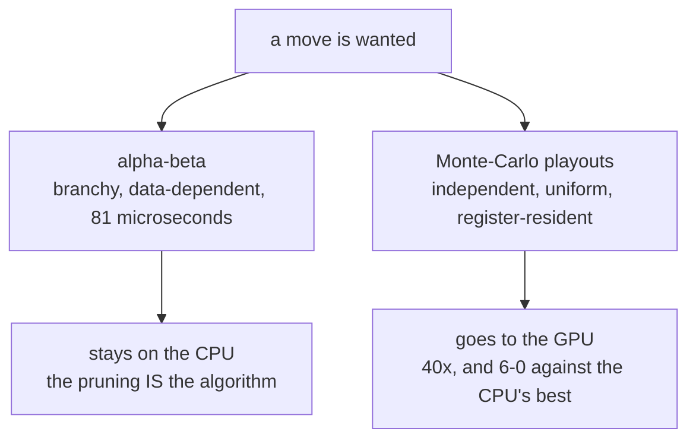

# Othello

**A board game on the GPU, which is mostly a bad idea, done anyway — and the
useful part is knowing exactly which half of it was worth doing.**

You are black, on green felt. Four computer opponents: two random-ish, one
alpha-beta, and one that plays sixteen thousand random games in three
milliseconds and picks whichever move won most. The last one is on the GPU.
The other three are not, and *that is the point of the example.*

| | |
|:---|:---|
| **Source** | `examples/othello/` — three files, 1,000 lines |
| **Board** | two 64-bit words, no arrays |
| **Players** | Beginner, Intermediate, Advanced (alpha-beta 4-ply), Master (GPU) |
| **Kernel** | one, dispatched once per move |
| **Threads per move** | 4,096 per candidate — about 40,000 for a typical position |
| **Verified against** | published perft counts to depth 7 (55,092) |

## These documents

| Chapter | What it covers |
|:---|:---|
| [1. Where the ideas come from](01-history.md) | Norvig's array board, bitboards, alpha-beta, and how Monte-Carlo got respectable |
| [2. Does a board game want a GPU?](02-the-argument.md) | The honest answer — mostly no — and the measurements behind both halves of it |
| [3. The board is two integers](03-board.md) | `board.mojo`: the whole ruleset as shifts and masks |
| [4. Four players and one kernel](04-players.md) | `ai.mojo`: the evaluation, the search, the playout, the dispatch |
| [5. The window and the pump](05-the-app.md) | `main.mojo`: why the event loop is hand-rolled, and the bug that taught it |
| [6. What to understand](06-key-points.md) | The things that will surprise you, and the ones that will bite |
| [7. The sequel that does not work](07-mcts.md) | The hybrid UCT spike, four fixed bugs, and why it still loses 0–6 |

## The shortest possible summary

An Othello position is 64 squares. A machine word is 64 bits. So the position
is **two words** — the squares you hold and the squares your opponent holds —
and every rule in the game becomes shifts and masks over those two words.

That representation is what makes the rest possible. A single GPU thread can
hold an entire game in two registers, which means it can play one out to the
end without touching memory, which means ten thousand threads can each play a
different game at once and never talk to each other.

That is the *only* part of a board game shaped like a GPU problem. The
strongest classical technique — alpha-beta — is shaped like the exact
opposite: its whole advantage is skipping work based on what it has already
found, and threads that skip different work diverge. So the example ships
alpha-beta on the CPU and Monte-Carlo on the GPU, and says so.

The measurements are the argument:

| | |
|:---|:---|
| alpha-beta, 4 ply | **81 µs** on the CPU — nothing to accelerate |
| 16,384 playouts | **136.8 ms** CPU vs **3.4 ms** GPU — 40× |
| Master (GPU) vs Advanced (alpha-beta) | **6–0**, margins of 6 to 26 discs |

<!-- doccrate:keep-together:start -->

<!-- doccrate:keep-together:end -->
