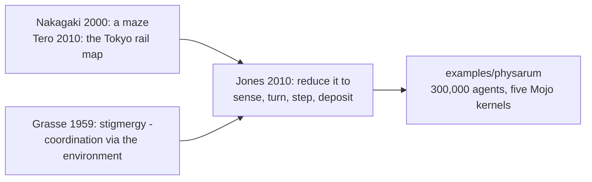

# 1. The organism

## A single cell that solves mazes

*Physarum polycephalum* is a slime mould: not a plant, not a fungus, not an
animal, and — for the part that matters here — **not made of cells**. In its
plasmodial stage it is one enormous cell with many nuclei, a spreading yellow
sheet that creeps over rotting wood looking for food.

It has no brain. It has no nervous system. It has nothing that could be called
a component that makes decisions.

In 2000, Toshiyuki Nakagaki and colleagues published a short paper in *Nature*
titled **"Maze-solving by an amoeboid organism"**. They grew a plasmodium
across an agar maze, placed oat flakes at the entrance and the exit, and came
back. The mould had withdrawn from every dead end and left a single thick vein
along the **shortest path** between the two food sources.

Ten years later the same group did something harder. In **"Rules for
Biologically Inspired Adaptive Network Design"** (*Science*, 2010), Atsushi
Tero and colleagues laid oat flakes on a map of the Tokyo area at the
positions of the major stations and let a plasmodium grow across it. The
network it produced was comparable to the actual Tokyo rail network in total
length, transport efficiency and tolerance to a severed link.

Both results won Ig Nobel Prizes, and both are the reason anyone in computing
cared: **a network with no designer, arriving at the answer a designer arrived
at.**

## The model: one rule instead of an organism

What this example runs is not a simulation of slime-mould biology. It is a
much later, much simpler thing.

Jeff Jones's 2010 work on approximating Physarum transport networks reduced
the behaviour to a population of identical agents, each carrying only a
position and a heading, each doing four things per step:

1. **sense** the trail map at three points ahead — left, centre, right
2. **turn** toward whichever reads strongest
3. **step** forward
4. **deposit** into the map at its new position

Plus one rule for the map itself: **spread and fade**.

That is the entire model. It is not derived from the organism's chemistry; it
is an observation that agents which follow their own accumulated traces
produce networks with the same character. The example's header states the
claim exactly at that level:

> *the branching, converging veins that a real slime mould grows to solve a
> maze emerge from that alone, the same way the reef in `grayscott` emerges
> from two numbers rather than being drawn.*

## Stigmergy

The mechanism has a name, and it is older than the slime-mould work.

Pierre-Paul Grassé, studying termite mound construction in 1959, needed a word
for the fact that termites were plainly cooperating while plainly not
communicating. His answer was that they were not coordinating with each other
at all: each termite responded to **the state of the structure**, and its
response changed that state, which changed what the next termite responded to.
He called it **stigmergy** — coordination through the environment.

Ant pheromone trails are the same idea. So is this program:

> *No agent knows about any other agent, and no cell of the map knows it is
> part of a network.*

There is no communication in the file. There is no agent-to-agent lookup, no
neighbour list, no spatial index. There is a shared array that everyone reads
and everyone writes, and that is sufficient.

## Why the fading matters

The decay term is not an aesthetic choice, and it is what makes stigmergy work
rather than merely accumulate.

Without decay, every path ever taken persists. After a few hundred frames the
map is uniformly bright, all three sensors read the same value, and the agents
turn randomly forever — a network that has dissolved into noise by
remembering too much.

Decay makes the trail a **claim that has to be renewed**. A route stays visible
only while agents keep using it; a route nobody takes disappears. That is
precisely the dead-end withdrawal Nakagaki photographed, and it falls out of a
multiply.

```mojo
out_t[unsafe_offset=idx] = (s / Float32(9.0)) * decay
```

The source puts it better than a paragraph can:

> *A trail is a rumour: it spreads to its neighbours and fades unless agents
> keep repeating it.*

<!-- doccrate:keep-together:start -->

## Four presets, and an honest note about them

```mojo
# Unlike Gray-Scott's feed/kill plane, Physarum has no narrow sweet spot --
# nearly any sensor angle, turn angle and sensor distance produce SOME
# branching network, so these four are this file's own tuning rather than
# values looked up from a paper.
```

| preset | sensor angle | turn angle | sensor distance | decay |
|:---|---:|---:|---:|---:|
| web | 0.45 | 0.30 | 9.0 | 0.94 |
| coil | 0.20 | 0.50 | 6.0 | 0.92 |
| sparse | 0.60 | 0.25 | 16.0 | 0.96 |
| dense | 0.35 | 0.35 | 5.0 | 0.90 |

<!-- doccrate:keep-together:end -->

That comment is worth reading beside [Gray-Scott's](../GrayScottWalkthrough/01-history.md),
which says the opposite about its own numbers — that they are *"the widely
reproduced values this model is usually shown with, not a guess"*, because
being a few thousandths out gives a uniform grey.

Two examples in the same collection, two different provenances, each labelled.
Gray-Scott's parameter plane has sharp boundaries and a published map, so its
values are cited. Physarum's does not, so its values are described as tuning
and not dressed up as anything else.

The presets read as a coherent set once you know what each dial does:

- **coil** — sensors close together (0.20) and sharp turns (0.50): an agent
  commits hard to small differences, so trails curl.
- **sparse** — sensors wide (0.60) and far ahead (16.0), turns gentle (0.25),
  decay slow (0.96): agents commit to long straight runs and the traces
  persist, giving long branches.
- **dense** — everything short and fast-fading: many small features.

<!-- doccrate:keep-together:start -->



<!-- doccrate:keep-together:end -->
