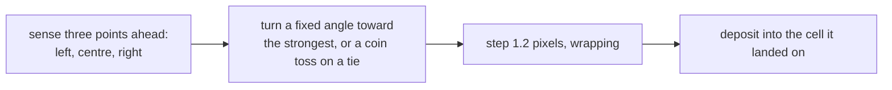

# 2. The rule

An agent is three floats: `x`, `y`, and a heading `a`. Not a struct — three
separate arrays, which [chapter 3](03-why-gpu.md) explains.

Everything an agent ever does is in one kernel, and the docstring is the
specification:

> *Sense three points ahead, turn toward the strongest, step, deposit. That is
> the entire behaviour — an agent holds no memory of where it has been, and
> reacts to nothing but the shared map every other agent is also reading and
> writing.*

## Sense

```mojo
var sl = _at(trail, Int(x + cos(a - sensor_angle) * sensor_dist),
                    Int(y + sin(a - sensor_angle) * sensor_dist))
var sc = _at(trail, Int(x + cos(a) * sensor_dist),
                    Int(y + sin(a) * sensor_dist))
var sr = _at(trail, Int(x + cos(a + sensor_angle) * sensor_dist),
                    Int(y + sin(a + sensor_angle) * sensor_dist))
```

Three samples: `sensor_angle` to the left of the heading, straight ahead, and
the same angle right. Each at `sensor_dist` away.

Two parameters, and between them they set the agent's whole character:

- **`sensor_angle`** is how *different* the three directions are. Narrow (coil,
  0.20) and the agent is choosing between three nearly-identical options, so
  tiny differences in the map decide its turn. Wide (sparse, 0.60) and it is
  comparing genuinely different directions.
- **`sensor_dist`** is how far ahead it looks. Short (dense, 5.0) and it
  responds to what is immediately in front — fine, twitchy structure. Long
  (sparse, 16.0) and it commits to distant features, ignoring what it is
  walking over.

Note there is no gradient, no derivative, no least-squares fit to the field.
Three samples and two comparisons.

## Turn

```mojo
if sc > sl and sc > sr:
    pass
elif sl > sr:
    a -= turn_angle
elif sr > sl:
    a += turn_angle
else:
    var r = _rand01(UInt32(idx) * UInt32(747796405) + frame)
    a += turn_angle if r > Float32(0.5) else -turn_angle
```

Straight ahead wins ties against the sides — `sc > sl and sc > sr` first — so
an agent on a good trail keeps going rather than wobbling. Otherwise it turns
`turn_angle` toward the better side.

Note the turn is a **fixed step, not proportional to the difference**. An agent
sensing a marginally brighter left turns exactly as hard as one sensing a
vastly brighter left. That is a modelling choice with a visible consequence:
agents cannot ease into a curve, so trails are made of small discrete
corrections, and the characteristic filament texture comes from that.

The `else` branch is the interesting one. If left and right read *exactly*
equal — which on an empty map is every agent on the first frame, and later
happens wherever the field is flat — the agent picks a side at random.

Without it, a tie would leave the heading unchanged and every agent would walk
in a straight line until it happened to find a trail. The map would stay
blank far longer, and the initial symmetry would break much more slowly.

And the randomness is a **hash**, not a generator — see
[chapter 4](04-kernels.md).

## Step

```mojo
var nx = x + cos(a) * Float32(1.2)
var ny = y + sin(a) * Float32(1.2)
if nx < Float32(0.0):
    nx += Float32(WIDTH)
elif nx >= Float32(WIDTH):
    nx -= Float32(WIDTH)
```

1.2 pixels per step, and the world **wraps**. An agent leaving the right edge
reappears on the left.

That decision propagates, and the source is explicit about the consequence:

```mojo
def _at(f, x, y) -> Float32:
    """The trail map wraps, not clamps: an agent that walks off the right
    edge reappears on the left, so the map it senses and deposits into
    must wrap the same way or a trail would smear against a false wall
    the agents themselves never see."""
```

This is the one place Physarum departs from Gray-Scott's discipline, and for a
good reason. Gray-Scott **clamps** — its cells do not move, so a reflecting
boundary is the natural physical choice. Physarum's agents *travel*, so a
clamped map would give them a torus to walk on and a rectangle to sense on:
an agent that wrapped from x = 767 to x = 0 would find its own trail apparently
piled up against a wall that only the map believes in.

A 1.2-pixel step is also deliberate. Less than one and agents deposit into the
same cell repeatedly, making dotted trails; much more and they skip cells, so
a trail becomes a dashed line the sensors read as gaps.

## Deposit

```mojo
var cidx = _wrap(Int(ny), HEIGHT) * WIDTH + _wrap(Int(nx), WIDTH)
trail[unsafe_offset=cidx] = trail[unsafe_offset=cidx] + DEPOSIT
```

Add `DEPOSIT` (5.0) to the cell the agent has landed on. Read, add, write —
and **not atomically**, which is a deliberate decision covered in
[chapter 3](03-why-gpu.md).

Note that the agent deposits at its **new** position, having already turned and
moved. So the trail records where agents *went*, not where they were.

## And the map's own rule

Agents alone are not enough. A trail deposited into one cell is invisible to
every agent that is not aimed exactly at that cell — so the map has to spread
what it receives:

```mojo
"""A trail is a rumour: it spreads to its neighbours and fades unless
agents keep repeating it. The nine-point box average IS the spreading;
multiplying by `decay` afterward is the fading. Both happen to every
cell whether or not an agent ever visited it -- there is no separate
'has this pixel ever seen an agent' bit anywhere."""
```

```mojo
s += _at(in_t, x - 1, y - 1)
... nine of them ...
out_t[unsafe_offset=idx] = (s / Float32(9.0)) * decay
```

A plain nine-point **box average** — all weights 1/9 — and then a multiply.

Worth comparing with Gray-Scott's Laplacian, which looks similar and is not:

<!-- doccrate:keep-together:start -->

| | Physarum | Gray-Scott |
|:---|:---|:---|
| weights | all 1/9 | 0.05 / 0.2 / −1.0 |
| they sum to | **one** | **zero** |
| what it returns | a value — the local average | a rate of change |
| what it is | a blur | a Laplacian |

<!-- doccrate:keep-together:end -->

Both are nine-point stencils over the same neighbourhood, and they do opposite
things. Gray-Scott needs a rate of change because it *integrates* it into an
existing field. Physarum wants the average itself, because the average **is**
the new value.

Blur and decay are one kernel and one multiply, and between them they are the
entire memory of the system.

<!-- doccrate:keep-together:start -->



<!-- doccrate:keep-together:end -->
