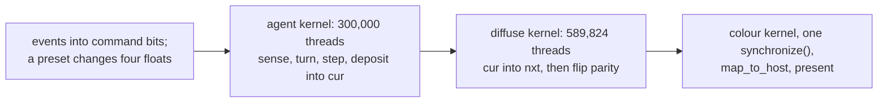

# 5. A frame, end to end

Three dispatches. This is the shortest frame in the collection.

## Before the loop

```mojo
ctx.enqueue_function(init_kern, px, py, pa, grid_dim=(AGENT_GRID), block_dim=(BLOCK))
ctx.enqueue_memset(trail_a, Float32(0.0))
ctx.enqueue_memset(trail_b, Float32(0.0))
ctx.synchronize()
```

Three agent arrays scattered by the init kernel, two trail buffers zeroed. The
initial state is 300,000 agents at random positions on an **empty** map — so
for the first few frames every sensor reads zero, every turn is a coin toss,
and the agents wander. The structure appears as soon as enough trail exists
for the sensors to have an opinion, which takes a couple of seconds and is
worth watching.

## Step 1: events, into flags

```mojo
comptime CMD_CLICK = 1
comptime CMD_PAUSE = 2
comptime CMD_RESET = 4
comptime CMD_QUIT = 8
comptime CMD_PRESET = 16
comptime CMD_SAVE = 32
```

The same house rule as Fluid, Othello and Gray-Scott: the view's handlers set
bits and nothing else, because a `DeviceContext` lives in a local that a Cocoa
callback cannot reach. The pump owns the GPU.

Bits rather than booleans so two commands in one frame cannot lose each other.

And the same `let`/`var` discipline on the way out — read the flags out of the
global before clearing, because `let` binds to a place in this dialect.

## Step 2: the three dispatches

```mojo
if not paused:
    ctx.enqueue_function(
        agent_kern, px, py, pa, cur, UInt32(frames),
        sensor_angle, turn_angle, sensor_dist,
        grid_dim=(AGENT_GRID), block_dim=(BLOCK),
    )
    ctx.enqueue_function(
        diffuse_kern, nxt, cur, decay, grid_dim=(GRID), block_dim=(BLOCK)
    )
    parity = 1 - parity
    cur = trail_a if parity == 0 else trail_b

ctx.enqueue_function(color_kern, dev, cur, grid_dim=(GRID), block_dim=(BLOCK))
ctx.synchronize()
```

Read the order carefully, because it matters.

**The agent kernel writes into `cur`** — the current trail map. Agents both
sense and deposit into the same buffer, in the same dispatch. That is safe
in a way the stencil kernels are not, because an agent reads three *scattered*
points and writes one *unrelated* point; there is no neighbourhood being
consumed. A deposit landing in a cell another agent is about to sense is not a
correctness problem, it is the mechanism.

**The diffuse kernel reads `cur` and writes `nxt`** — separate buffers,
because this one *is* a stencil and every cell needs its neighbours' old
values.

**Then the parity flips.** So the fresh map becomes `cur` for the next frame,
and the colour kernel reads it.

## The parity trick, and how it differs from Gray-Scott's

Gray-Scott ping-pongs by **argument order** in an even loop:

```mojo
for _step in range(SUBSTEPS // 2):
    ctx.enqueue_function(gs_kern, u2, v2, u, v, ...)
    ctx.enqueue_function(gs_kern, u, v, u2, v2, ...)
```

Twenty substeps, an even number, so the state always lands back in `u, v` and
nothing has to track which buffer is current.

Physarum diffuses **once** per frame, so the buffer genuinely alternates and
there is no even count to hide behind. It tracks the parity explicitly:

```mojo
parity = 1 - parity
cur = trail_a if parity == 0 else trail_b
```

Both are correct; the choice follows from the step count. An odd number of
swaps per frame needs a variable, an even number does not — and Gray-Scott
took the trouble to make its count even *because* it wanted to avoid this
variable.

Note also that `paused` skips both simulation dispatches but **not** the colour
kernel, so a paused frame is still drawn. The colour kernel is deliberately
outside the `if`.

## Step 3: the one blocking point

`ctx.synchronize()` after three enqueued dispatches. Everything before it was
queued and is paid for once.

Then the copy to the host buffer, the optional PNG, and the present — all
identical to Gray-Scott, including the comment:

```mojo
# Save here, not later: `bgra` is exactly what is about to be
# presented, so the file and the window cannot disagree.
```

## Preset switching, mid-flight

```mojo
if (pending & CMD_PRESET) != 0:
    ...
    sensor_angle = preset_sensor_angle(preset)
    turn_angle = preset_turn_angle(preset)
    sensor_dist = preset_sensor_dist(preset)
    decay = preset_decay(preset)
```

Four floats change and the next dispatch is a different regime — **the map is
not cleared and the agents are not moved**. So an established web reorganises
into a coil in front of you, which is far more informative than a fresh start:
you see which structures survive the change and which dissolve.

`r` does the other thing — reseeds the agents *and* clears both trail buffers,
because agents scattered onto an old network would just re-follow it.

## Verification: looking at the picture

The commit is explicit that a clean exit was not considered proof:

> *Verified the same way grayscott was: actual saved PNGs, not just a clean
> exit. The default preset produces the textbook thick branching vein network;
> switching to "coil" on the same agent count visibly thins the filaments into
> tighter curls — proof the parameters reach the kernel, not just a label
> changing.*

The specific risk being tested for is worth naming: a preset switch that
updated the window title and the local variables but failed to *pass* them to
the dispatch would look completely correct from the outside. Every automated
check would pass. Only two visibly different pictures rule it out.

<!-- doccrate:keep-together:start -->



<!-- doccrate:keep-together:end -->
