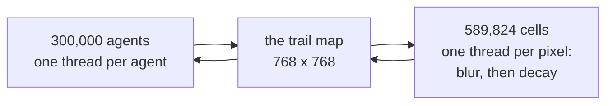

# Physarum

**Three hundred thousand agents, each obeying one rule that fits in a
sentence, and a branching vein network that no line of code describes.**

An agent looks three ways. It turns toward whichever direction smells
strongest. It steps forward, and leaves a trace. That is the whole behaviour —
and no agent knows about any other agent, and no cell of the trail map knows
it is part of a network.

The branching, converging veins that a real slime mould grows to solve a maze
come out of that alone.

## The shortest possible summary

There are **two** populations on the GPU, and that is what makes this example
different from every other one in the collection. The agent kernel is
addressed by *agent index* — 300,000 threads, one per creature. The trail
kernels are addressed by *pixel index* — 589,824 threads, one per cell. They
meet only through a shared map that both read and write.

That is **stigmergy**: coordination achieved by modifying a shared
environment, rather than by any agent communicating with any other. Termites
build mounds this way. Ants find food this way. Here, three hundred thousand
independent walkers grow a transport network without any of them being able to
see it.

The trail map gets its own treatment once a frame — a nine-point box blur that
spreads it, times a decay factor that fades it. Without spreading, an agent
could never sense a neighbour's trail. Without fading, every path ever taken
would persist and the map would saturate to uniform bright.

> *A trail is a rumour: it spreads to its neighbours and fades unless agents
> keep repeating it.*

## These documents
<!-- doccrate:keep-together:start -->

| Chapter | What it covers |
|:---|:---|
| [1. The organism](01-history.md) | A mould that solves mazes, and the model that reduced it to one rule |
| [2. The rule](02-the-rule.md) | Sense, turn, step, deposit — and why the trail has to fade |
| [3. Why this belongs on a GPU](03-why-gpu.md) | Two populations at once, and the race the file accepts on purpose |
| [4. The five kernels](04-kernels.md) | Every kernel line by line, and hashing instead of an RNG |
| [5. A frame, end to end](05-a-frame.md) | Three dispatches, one ping-pong, and the parity trick |
| [6. What to understand](06-key-points.md) | The things that will surprise you, and the ones that will bite |

<!-- doccrate:keep-together:end -->

<!-- doccrate:keep-together:start -->

## At a glance

| | |
|:---|:---|
| **Source** | `examples/physarum/main.mojo`, 738 lines |
| **Agents** | 300,000 — one thread each |
| **Trail map** | 768 × 768 — 589,824 cells, one thread each |
| **Per frame** | 3 dispatches: agents, diffuse, colour |

<!-- doccrate:keep-together:end -->

