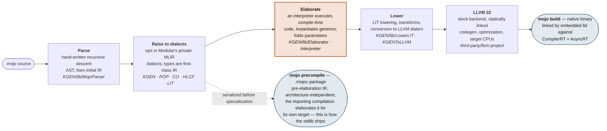
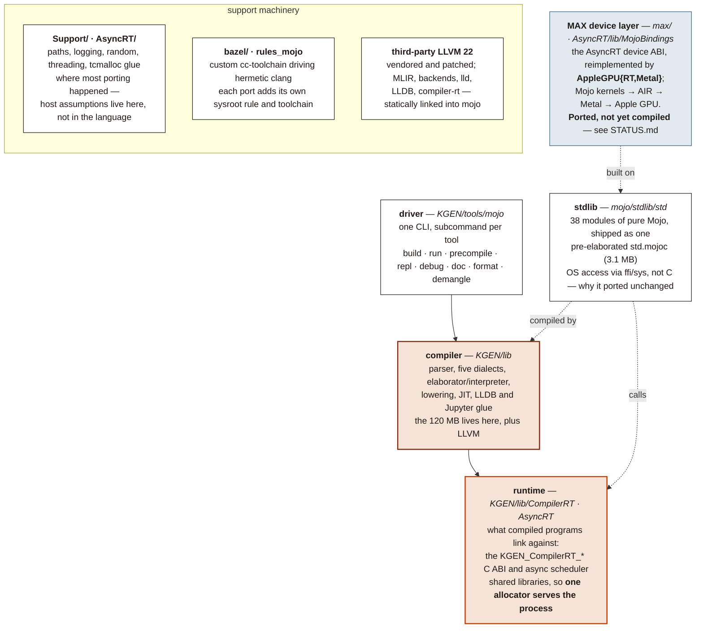

# MojoCocoa — Mojo as a first-class local language on the Mac

> [!WARNING]
> **This is the newest of these ports and it does not work yet.** The Cocoa
> support is real and verified — 9 of 9 spikes pass and the example apps
> build — but the **Apple Silicon GPU stack has never been compiled**. It is
> ported source, nothing more. Expect breakage, expect the API to move, and
> read [`STATUS.md`](STATUS.md) before relying on anything here.

**A personal-computer port of Mojo: the compiler and standard library, built to
run natively on hardware we own, using the operating-system features and the
specific accelerators that machine actually has.**

Mojo's premise is that one source file should specialise to whatever silicon
you point it at. These repositories take that premise literally and aim it at
ordinary personal computers — not a server, not a cloud instance, not a Linux
VM standing in for the real thing, but the machine on the desk. Each port
targets one host, one CPU, and one accelerator, and each is described the same
way: what runs, what does not, and what has merely been built rather than
tested.

## Acknowledgements

Mojo is a serious piece of language engineering, and Modular open-sourced the
compiler and the standard library under Apache 2.0 with LLVM exceptions — a
patent grant, no field-of-use restriction, and no hardware limits on the
source. That decision is what makes work like this both legal and possible:
you can take the source, aim it at hardware its authors never targeted, and
find out what happens. Not much of the industry gives you that.

It is worth being precise about how much it bought. These ports are not
rewrites; they are hooks into extension points that were deliberately left
public — target registries, the elaborator, the device ABI. Against a closed
compiler most of this would not have been a long job, it would have been an
impossible one.

Thanks to Chris Lattner and the team at Modular who designed and built Mojo,
and to everyone who has contributed to the compiler and the standard library
since. All original design credit is theirs. The mistakes in these ports are
ours.

Upstream is [modular/modular](https://github.com/modular/modular). If you want
supported Mojo, use [the real thing](https://mojolang.org) on a platform
Modular ships for.

## What this is

**A fork of [modular/modular](https://github.com/modular/modular) that teaches
the Mojo compiler about Cocoa, so writing a native macOS application in Mojo is
an ordinary thing to do rather than an exercise in hand-transcribing
Objective-C metadata.**

Nothing here is a binding layer. The compiler reads the macOS SDK itself, at
compile time, and checks what you wrote against it:

```mojo
comptime assert size_of[CGRect]() == cocoakb_struct_size["CGRect"]()
comptime assert offset_of[CGRect, "size"]() == cocoakb_field_offset["CGRect", "size"]()

var s = msg_send[ObjCObject, "NSString", "stringWithUTF8String:", is_class=True](cls, p)
```

A struct that drifts from the SDK fails to build. A selector typo is a compile
error at the line that asked. An argument passed in the wrong register file is
a compile error. None of that is a runtime surprise, and none of it was
hand-written.

> [!IMPORTANT]
> This is not a Modular product and is not affiliated with, endorsed by, or
> supported by Modular or Apple. Please do not file issues, discussions or
> support requests with Modular, or on the upstream repository, for anything
> you build or break here — nothing in this tree is theirs to answer for. The
> AIR backend and the GPU runtime in particular are this fork's own code. It
> carries no warranty and does not accept contributions. See
> [An experiment, not a product](#an-experiment-not-a-product).

## The ports

Five machines, five ports, one language. Each row is a separate
repository. They share an ancestor and most of their tree, and differ in
host architecture, in which accelerator runtime is active, and in how far
each has been pushed — so the row for one is not evidence for another.
Where a claim in this README rests on work done in a sibling repository,
it says so.

| Port | Host | Reference hardware | Accelerator path | Where it stands |
| --- | --- | --- | --- | --- |
| [**WINMOJO**](https://github.com/albanread/WINMOJO) | Windows 11 ARM64<br/>`aarch64-pc-windows-msvc` | Qualcomm Oryon (Snapdragon X)<br/>Adreno X1-45 | Mojo → SPIR-V → OpenCL,<br/>via `dragonrt` | `mojo build` and `mojo run` both work; lldb builds and debugs Mojo binaries; Adreno Mandelbrot at 11–13 ms/frame; 258 of 369 stdlib test targets pass |
| [**maxdragon**](https://github.com/albanread/maxdragon) | Windows 11 ARM64<br/>`aarch64-pc-windows-msvc` | Qualcomm Oryon (Snapdragon X)<br/>Adreno X1-45 · Hexagon NPU | Mojo → SPIR-V → OpenCL,<br/>via `dragonrt`; the NPU through QNN at graph level, outside Mojo | `mojo build` works; the JIT is not enabled on this branch; the Adreno acceptance test passes and Mandelbrot runs at 16 ms/frame against 250 ms on one CPU core; the Hexagon reaches 4.1× the CPU on gigabyte-scale graphs; 258 of 369 stdlib test targets pass |
| [**WINMOJOX64Blackwell**](https://github.com/albanread/WINMOJOX64Blackwell) | Windows 11 x64<br/>`x86_64-pc-windows-msvc` | Intel Core Ultra 9 285H<br/>NVIDIA RTX PRO 2000 Blackwell (`sm_120a`) | Mojo → PTX → `nvcuda.dll`,<br/>via `nvptxrt` | `mojo build` and `mojo run` both work; TMA, CUDA graphs, completion flags and host callbacks all tested on hardware; REPL and LLDB packaged; no systematic SM120a kernel census yet |
| [**MojoMacX64**](https://github.com/albanread/MojoMacX64) | macOS x86-64<br/>Mac Pro 2019 | Intel x86-64<br/>AMD Radeon Pro Vega II 32 GB (gfx906) | Mojo → AIR → Metal,<br/>via `MetalRT` | Cocoa apps build and run; `msg_send` materialised to C speed (3660 ns → 3 ns); a Mandelbrot at 60fps whose escape iteration *and* colour are Mojo kernels on the Vega II; wave64 matmul lands 3.4× on prefill; a Mojo editor written in Mojo |
| [**MojoCocoa**](https://github.com/albanread/MojoCocoa) ← *you are here* | macOS ARM64<br/>Apple Silicon | Apple M4<br/>Apple GPU, 10 cores | Mojo → AIR → Metal<br/>(ported, never compiled) | **Newest, and not working yet.** The Cocoa compiler hook and `std.objc` pass 9 of 9 spikes and the example apps build, but the Apple Silicon GPU stack is ported source that has never been through a compiler |

None of these is finished, and none of them is trying to become the official port of anything.

## An experiment, not a product

This repository is an experiment, and the youngest of the five. It exists so
that one person could find out whether a compiler can read the operating
system rather than be told about it, and could record honestly what happened.
That is the whole of it.

Stated plainly, so that nothing here is taken for more than it is:

- **It does not work yet.** The Cocoa half is done and verified. The GPU half
  — the AIR lowering, the backend and the Apple GPU runtime — has been ported
  from [MojoMacX64](https://github.com/albanread/MojoMacX64) and **has never
  been through a compiler**. Two known gaps are already marked in the source
  (`TODO(air-indirect)` and `TODO(air-residency)`), and one of them is expected
  to bite. [`STATUS.md`](STATUS.md) is the current, honest picture.
- **It does not accept contributions.** There is no contributor guide, no CLA,
  no code of conduct and no review process, because there is no project here
  for anyone to join. Pull requests will not be reviewed. The upstream
  contribution documents that came with the fork have been deleted rather than
  left in place to imply otherwise. A change that Mojo itself should have
  belongs [upstream](https://github.com/modular/modular), not here.
- **It does not claim to be correct.** Everything was measured on one machine,
  by one person, and is reported as observed. The reference numbers in
  `STATUS.md` come from Modular's own wheel compiler and are a target to match,
  not a result achieved here.
- **It is not supported and will not be.** No releases, no roadmap, no
  packages, no obligation to keep working — and by design, no tracking of
  upstream after the fork point.

Reading it, building it, or taking ideas from it is exactly what the licence
permits and you are welcome to all three. Just don't mistake it for a product,
a distribution, or a community.

## Why

The Mac deserves better than being a place where you *can* run a language. The
aim is Mojo that opens an `NSWindow`, draws through a `CAMetalLayer`, handles
mouse and key events from Mojo functions on a class defined at runtime, and
does all of it with the compiler checking every selector against the SDK on the
machine you are building on.

`spikes/` has the evidence: Conway's Life with mouse drawing and age-coloured
cells, a Metal mandelbrot, and a Mojo editor-and-runner written in Mojo.

## Fixed at this release, forever

This fork never rebases on, merges, or tracks upstream. The fork point is the
whole point: a known-good snapshot of the open-sourced compiler, tuned for this
hardware until the machine stops working. Hardcoding for arm64 Darwin and the
M-series GPU is a feature, not a bug.

## Where this sits

This is the Mojo member of a family of ports that share one idea: **a compiler
should read the OS, not be told about it.** A single SQLite mirror of the macOS
Objective-C surface — [CocoaBaseMCP](https://github.com/albanread/CocoaBaseMCP),
built from the live runtime and BridgeSupport — backs all of them:

| project | language |
|---|---|
| **MojoCocoa** | Mojo |
| MacModula2 | Modula-2 |
| MacBCPL | BCPL |
| MF66 / MF67 | Forth |
| MacNCL, MRASM, MACVM | NCL, assembler, a research VM |

Each one gets struct layouts, enum values, selector existence, method
encodings, and ABI classification from the same database, so a fact learned
once is available to all of them. Adding a capability is a `SELECT`, not a new
generator.

Direct ancestor: [MojoMacX64](https://github.com/albanread/MojoMacX64), the same
work on an Intel Mac Pro driving a Radeon Pro Vega II. MojoCocoa is that port
retargeted to Apple Silicon — see `AIR_APPLE_SILICON.md` for what that involved
and why some of it got *simpler*.

## Status

| | |
|---|---|
| Cocoa compiler hook (`cocoakb`) | working — 9/9 spikes |
| `std.objc` — dispatch, ownership, runtime class definition | working |
| Cocoa example apps | building |
| Apple Silicon GPU stack (AIR + runtime) | ported, not yet compiled |

`STATUS.md` is the honest, current picture. `COCOA_ARM64.md` and
`AIR_APPLE_SILICON.md` are the design notes.

## The GPU part, and why it exists

Modular open-sourced a great deal — the frontend, elaborator, MLIR dialects and
the host backend are all here and genuinely buildable, which is the only reason
the Cocoa hook was possible at all. What they did not publish is GPU lowering:
only `Host` exists under the three `Target/` directories, and the wheels ship no
backend library.

So a compiler you build yourself cannot emit GPU code, however good Modular's
own is. `AIR_APPLE_SILICON.md` records the evidence and the plan: our own AIR
backend and our own runtime against the open `AsyncRT` C ABI, replacing
`libmax`/`libMGPRT` with code we can read.

## Building

Bazel, via the bundled wrapper — no toolchain install needed.

```bash
python3 ../CocoaBaseMCP/build.py        # the SDK database, ~12s
./bazelw build //spikes:life
./spikes/run-cocoa-checks.sh            # the 9 verification spikes
```

`local.bazelrc` selects `--config=build-mojo` and points the compiler at
`cocoa.sqlite`. Rebuild the database after a macOS update;
`cocoakb_query<"db_hash">` makes drift visible.

Requires Apple Silicon, macOS 15+, and Xcode 16+.

## Technical notes and journals

This README is the summary, and [`STATUS.md`](STATUS.md) is the honest current
picture — read that before relying on anything here.

| Document | What it covers |
| --- | --- |
| [`STATUS.md`](STATUS.md) | Where the port stands right now, what is verified, and what has never been compiled. The place to pick up. |
| [`COCOA_ARM64.md`](COCOA_ARM64.md) | The Cocoa hook on Apple Silicon: comptime SDK queries, dispatch, and the ARM64 calling convention. |
| [`UPSTREAM-README.md`](UPSTREAM-README.md) | Modular's own README, kept verbatim. |

### Apple Silicon GPU — the device port, not yet compiled

| Document | What it covers |
| --- | --- |
| [`AIR_APPLE_SILICON.md`](AIR_APPLE_SILICON.md) | The evidence and the plan: why a compiler you build yourself cannot emit GPU code (only `Host` exists under the three `Target/` directories, and the wheels ship no backend library), and the design of our own AIR backend and runtime against the open `AsyncRT` C ABI. Records what retargeting from AMD to Apple involved — and why some of it got *simpler*, since unified memory removes the staging blits entirely. |

The predecessor's write-up,
[`AIR_on_AMD.md`](https://github.com/albanread/MojoMacX64/blob/main/AIR_on_AMD.md)
in [MojoMacX64](https://github.com/albanread/MojoMacX64), is the deeper
document on AIR itself and is still the best account of the bitcode machinery
this port inherits.

The golden-sample technique `STATUS.md` describes — `xcrun metal -S -emit-llvm`
to get Apple's own IR and metadata, then round-tripping ours back in — is how
any claim about AIR here was checked, rather than guessed from tables.

---

# Anatomy of Mojo

*What one large compiler binary actually contains, how a `.mojo` file becomes
machine code, and where the runtime, standard library and MAX fit around it —
as found in the source tree during these ports.*

| | |
| --- | --- |
| **1** | binary: `mojo` — driver, parser, compiler, JIT, REPL, LSP |
| **120 MB** | `mojo` itself, with LLVM + MLIR statically inside |
| **5** | private MLIR dialects (KGEN, POP, CO, HLCF, LIT) |
| **38** | stdlib modules, pure Mojo, zero C in the library itself |
| **322** | stdlib test files |

## Part I — What Mojo is

Mojo is a systems programming language wearing Python's syntax. Functions,
structs, traits and generics compile to native code with no interpreter and no
GC, and ownership and borrow semantics do the memory management. Older writing
about Mojo describes a Python-style `def` coexisting with a systems-style `fn`;
that is no longer true at this version, which rejects `fn` with *"'fn' has been
removed; use 'def' instead"*. It was built by Modular as the language for
writing AI kernels — code that must run on CPUs, GPUs and accelerators from one
source — and that origin explains its two defining traits.

First, it is **MLIR-native**. Where most languages lower their AST to LLVM IR
directly, Mojo parses into Modular's own MLIR dialects and does nearly all of
its work — metaprogramming, generics, optimisation — as MLIR transformations.
LLVM only sees the final, fully-specialised result.

Second, **compile-time execution is the metaprogramming system**. There is no
separate template or macro language: `@parameter` code, generic instantiation
and constant evaluation all run in a built-in interpreter that executes the
same IR the compiler is building. Types are values at compile time.

The consequence is the unusual shape of the distribution: one large binary
containing a full compiler stack, plus a small runtime the generated code calls
into, plus a standard library written entirely in Mojo itself.

## Part II — From source to machine code



JIT variants of the same pipeline back `mojo run` and the REPL
(`KGEN/lib/ExecutionEngine`).

**Why the elaborator is the hot stage:** generic instantiation by compile-time
interpretation is what lets one kernel source specialise for any target, and it
is why a `.mojoc` is portable while a `.o` is not. It is also why the compiler
needs its runtime present at build time — compile-time code allocates through
the same `KGEN_CompilerRT` ABI that compiled programs use at run time.

## Part III — How the repository composes



**The shape every one of these ports discovered:** the language is portable and
the *substrate* is not. The standard library reaches the OS through `ffi`/`sys`
rather than C, which is why it moves to a new platform almost unchanged; the
host assumptions that had to be fixed live in `Support/`, `AsyncRT/` and the
Bazel toolchain. And the device layer is the one genuinely missing piece —
Modular publishes the API a kernel calls and the declarations of the ABI
underneath it, but not an implementation for hardware they do not ship for.
Each port here writes its own.

## Licence and attribution

The Mojo compiler (`KGEN/`), the C++ substrate, and the standard library are
licensed Apache 2.0 with LLVM exceptions, and this fork inherits that licence.
Everything added here carries the same licence.

This tree contains files under more than one licence. Read the root
[LICENSE](LICENSE), the [Licenses/](Licenses/) directory, the third-party
notices, and the licence header of each source file before redistributing a
build.

`LICENSE` and `Licenses/` are kept exactly as upstream has them, deliberately:
almost every file here is still Modular's Apache-2.0 code, a derivative work
has to ship the licence with it, and the same grant is what puts this fork's
own additions on a clear footing.

No Modular binary, wheel, or account has been used in this work. Everything
here is built from the published Apache-licensed source, and where a device
runtime was needed it was implemented against the published ABI rather than
extracted from a binary.

Upstream is [modular/modular](https://github.com/modular/modular). All
original design credit belongs to Modular.

I am not a lawyer, and nothing here is legal advice.
