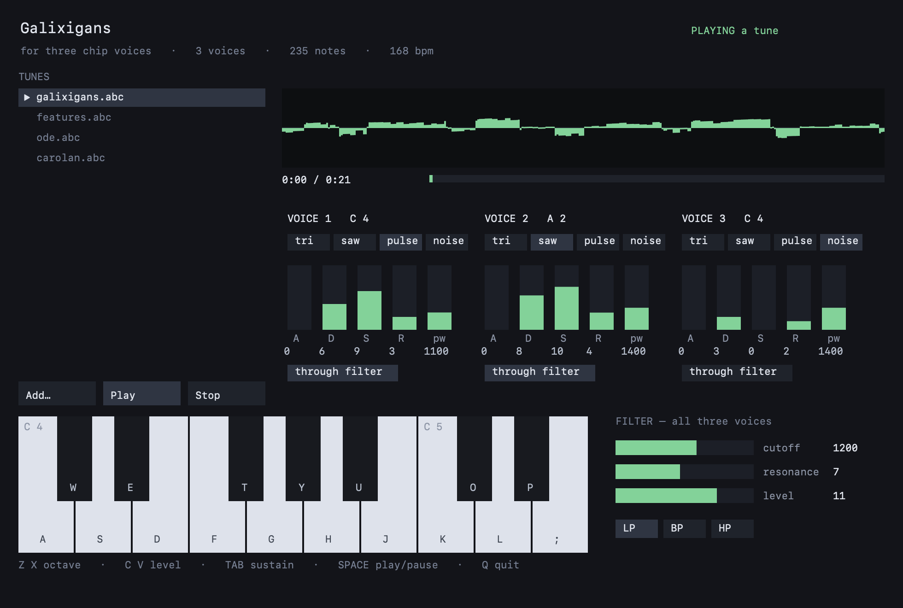

# An ABC player, in Mojo

Reads ABC notation — the format thousands of folk tunes are already written
in — and plays it, either through the chip in [`../chip/`](../chip/) or
through General MIDI. It also writes Standard MIDI Files.

    cocoamojo --build examples/abcplayer/main.mojo -o /tmp/abcplayer

    /tmp/abcplayer tunes/carolan.abc            # chip voices
    /tmp/abcplayer tunes/carolan.abc --midi     # Apple's DLS synthesiser
    /tmp/abcplayer tunes/carolan.abc --write=out.mid

    SPACE pause    Q quit

## Why bother

It is a port of a C++ ABC player, and it was worth doing for two reasons that
have nothing to do with Mojo being new: a complicated parser is a real test of
a language, and a music player is a real test of timing.

### The timing

An event scheduler usually looks like this, which is what the C++ does:

```cpp
std::this_thread::sleep_until(start + std::chrono::duration<double>(when));
sendMIDIEvent(event);
```

That asks the operating system to wake a thread at a moment. It will be late
by whatever the scheduler is busy with — a millisecond or two when idle, tens
under load. At 120bpm a semiquaver is 125 ms, so a 5 ms error is 4% of a note,
and the error changes from note to note, which is what makes it audible as
looseness rather than as a tempo.

Here the tune is compiled to a list of *"at sample N, do this"*, and the audio
callback applies each event at its exact offset inside the buffer. For the
chip that means rendering in spans between events; for MIDI it means handing
`MusicDeviceMIDIEvent` the sample offset it already accepts.

Measured, playing quarter notes at 120bpm through 512-frame buffers — a size
that deliberately does not divide the note length, so every onset falls
mid-buffer:

    scheduled   0    48000    96000   144000
    measured    0    48001    96001   144000
    worst error 1 sample = 0.021 ms

The one-sample errors are the onset detector's threshold, not the scheduler.

### The parser

ABC is terse and ambiguous in exactly the places real tunes use:

- `(` opens a slur, unless a digit follows — then it is a tuplet
- `[` opens a chord, unless it is `[K:` — then it is an inline field
- `|` is a bar line, unless a digit follows — then it also opens an ending
- an accidental holds **to the end of the bar**, so the second F in `^F A F`
  is also sharp, and the third, in the next bar, is not

Supported: headers `X T C O P M L Q K V`; notes with `^ ^^ _ __ =`, octaves
`,` and `'`; durations `A2 A/ A/2 A3/2`; rests `z x Z`; chords `[CEG]`;
chord symbols `"Am7"`; bar lines and repeats including first and second
endings; tuplets `(3` and `(p:q:r`; broken rhythm `> <`; ties; grace notes;
and `V:` with `name=`, `transpose=` and `octave=`.

Ignored deliberately, because a chip cannot hear them: slurs, decorations,
lyrics alignment, and clefs.

## What the port fixed

The C++ was not a working player with rough edges — parts of it had never
worked. Found by reading it before porting:

1. **Key signatures did nothing.** `KeySignature("G")` sets `sharps(0)` and
   never fills its `accidentals` map; nothing anywhere assigns `.sharps`, and
   `applyKeySignature()` returns its argument unchanged with the comment "For
   now, just return the semitone unchanged". **Every tune played in C major**
   regardless of `K:`. Folk material is mostly G, D and A, so that is most
   notes wrong.

2. **Explicit accidentals were dropped.** `isAccidental()` tests for `#` and
   `b`, which are not ABC's accidental characters — ABC uses `^` and `_`. It
   is unreachable anyway: the note branch is guarded by `isNote(*p)`, so
   `parseAccidental` only ever runs once the pointer is already on a letter.
   `^C` fell through to "Ignoring unknown character".

3. **First and second endings were ignored.** `expandABCRepeats` duplicates
   the text between `|:` and `:|` with a regex. `|: A |1 B :|2 C |` should
   play A B A C; it played A B A B, so a repeated strain ended on the wrong
   phrase every time. The `REP1`/`REP2` feature types exist in the enum and
   are never used.

4. **Middle C was an octave low.** `calculateMidiNote` computes
   `base_octave * 12 + semitone` with `base_octave = 4` for an uppercase
   note, giving 48 — where the comment two lines below says "C4 = 60".

5. **Chord symbols corrupted the melody's timeline.** `generateChordNotes`
   appends its tones to the melody voice, which advances that voice's clock,
   so every `"Am7"` pushed the tune that followed it out of step. Here they
   go to their own voice.

Numbers 1 and 2 are why this port is not a rewrite for its own sake: a tune
in `K:D` now plays in D.

## The window



`abcplayer` opens an interface rather than just playing and printing. Three
things live in it.

**A tune list.** Whatever is in `tunes/` beside the project is found at
startup; **Add…** opens a file panel for more. Click one and press **Play**, or
hit Space. **Stop** returns to live mode.

**A voice editor, showing all three voices at once.** There are only three, and
a patch is the relationship *between* them — which voice carries the melody,
which one is the noise channel — so none of them is hidden behind a tab. Every
register the chip actually has is on screen: the four waveforms (they AND together,
which is what the hardware did, so they are toggles and not a radio group),
attack, decay, sustain, release, pulse width, filter routing, cutoff,
resonance, filter mode and master level. Cutoff, resonance and level sit in
their own block underneath, labelled, because they belong to the one filter all
three voices share — a control that looks per-voice and is not would be worse
than no label at all. Drag a bar and the sound changes under your fingers,
because these are register writes and the render callback reads the registers
on its own clock.

**A playable keyboard**, using Logic Pro's and GarageBand's *Musical Typing*
layout — the mapping a Mac musician already has in their fingers:

```text
     W E   T Y U   O P          the black keys, in their piano positions
    A S D F G H J K L ;         the white keys, from C
```

`R` and `I` are gaps because a piano has no black key between E and F, or
between B and C.

| Key | |
|:---|:---|
| `Z` `X` | octave down / up |
| `C` `V` | level down / up |
| `Tab` | sustain |
| `Space` | play / pause |
| `Q` `Esc` | quit |

`Z X C V` are free for that job precisely because they are not note keys, which
is why Logic chose them and why this does too.

Velocity is deliberately absent. The chip has no per-note velocity — neither
did the 6581 — so `C` and `V` move the master level, which is the register that
exists.

Three voices means three notes. A fourth steals the oldest, which is what a
three-oscillator chip has to do.

`ABC_SHOT=<path>` draws one frame to a PNG and exits, so the window can be
checked without a person at the screen.

## Changing the sound mid-tune: `[I:chip …]`

ABC's `I:` field is specified as instructions to the software, which is exactly
what a chip register is, so the directive goes there rather than inventing
syntax nobody else would recognise. It is inline, so it applies at the point in
the music where it is written:

```abc
[I:chip v=1 wave=pulse pw=1100 a=0 d=6 s=9 r=3 cutoff=1200 res=7 vol=11]ACEA cAec
[I:chip v=1 pw=350 cutoff=450]aged cAEC
```

| Key | |
|:---|:---|
| `v=` | which voice the per-voice keys apply to; the current one otherwise |
| `wave=` | `tri` `saw` `pulse` `noise`, joinable with `+` — the chip ANDs them, as the hardware did |
| `pw=` | pulse width, 0–4095 |
| `a= d= s= r=` | envelope, 0–15 each |
| `filt=` | `on` / `off` — route this voice through the filter |
| `cutoff= res= mode=` | the shared filter: 0–2047, 0–15, `lp` `bp` `hp` |
| `vol=` | master level, 0–15 |

Unknown keys are ignored rather than refused, so a tune using a setting this
build does not have still plays its notes.

A directive is not special machinery. It becomes a `Step` at a sample position
exactly like a note-on, and is applied on the audio thread by a function that
allocates nothing and cannot raise — the same contract the notes keep, because
it runs from the same place they do. The panel reads the chip's registers
rather than its own copy of them, so you can watch a tune move the sliders.

`tunes/galixigans.abc` is the demonstration: a dive where the pulse width
narrows and the filter closes as they come at you, a four-step power-up with
the cutoff opening on every bar, and a fanfare. It is in A minor throughout the
defence and ends in A major. The picardy third is the joke — it is a
triumphant ending, and the triumph is not ours.

## How it is put together

| File | What it does |
| --- | --- |
| [model.mojo](model.mojo) | events, voices, and key-signature arithmetic |
| [parse.mojo](parse.mojo) | headers, and the header/body split at `K:` |
| [music.mojo](music.mojo) | the music-line parser |
| [repeats.mojo](repeats.mojo) | repeats and endings, expanded over events |
| [schedule.mojo](schedule.mojo) | ticks to samples; ties; ordering |
| [chipplay.mojo](chipplay.mojo) | driving the chip from a schedule |
| [midi.mojo](midi.mojo) | Standard MIDI File output |
| [main.mojo](main.mojo) | CoreAudio, both backends, and the window |
| [chip.mojo](chip.mojo) | the synth engine, vendored from `../chip/` so this opens and runs as one folder |

**Time is an integer everywhere.** Durations are ticks at 480 per quarter
note — MIDI's own resolution — which divides exactly by everything ABC can
ask for: a 1/64 note is 30 ticks, a triplet eighth is 160, a dotted quarter is
720. Nothing rounds until the single conversion to samples, so a tune that
should land on the bar line does, however many tuplets and dots came first.

The MIDI file is the proof. It opens in any notation program, so the pitches,
the lengths and the bar positions can be checked by something that was not
written here.

## Notes on this compiler

Four things cost real time, and none produced a useful diagnostic:

- **`let` binds by reference.** `let t = times[a]` names the list slot; an
  insertion sort that shifts elements then overwrites the value it is placing,
  and silently loses entries. `var` copies. This is the same rule already
  written up in `CLAUDE.md`, and it reached here three more times.
- **`+=` through a List subscript updates a temporary.** `voices[i].tick +=
  n` compiles and does nothing. Read into a local, add, assign back.
- **Passing `mut Struct` on to a second function** from one that already holds
  it crashes at the call, with a stack in the Mojo runtime and no source
  location. Methods on the struct are fine; free functions are not. The chord
  emitter, the bar mirror and the broken-rhythm handler are all written inline
  for this reason.
- **A `fn` returning a heap-owning type** (a `List`, or a struct with a
  `String`) crashes the compiler in `DialectConversion` — "incorrect # of
  replacement values". `def` is fine.
