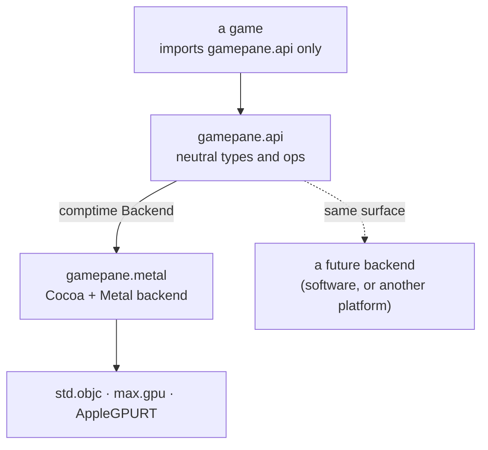
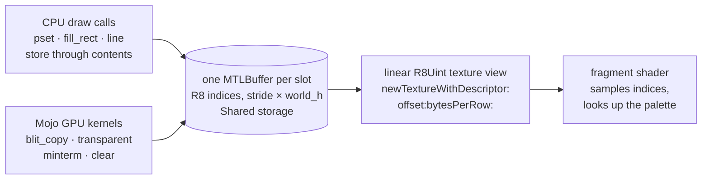
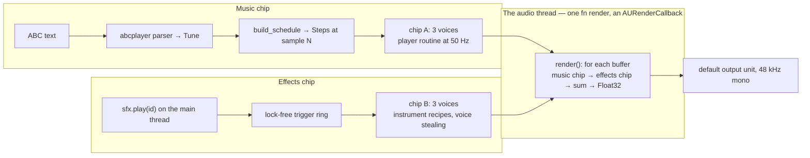

# MacGamePane in Mojo — design

A port of [MacGamePane](https://github.com/albanread/MacGamePane) — the
layered retro game engine (shader background, 8-bit indexed framebuffer with
per-scanline palettes, GPU blitter, sprites, text, SFX synth, ABC tunes) — to
cocoa-mojo, as a `gamepane` package with two tiers: a **platform-neutral API**
games are written against, and **one Metal backend** behind it. The point is
the second half of the sentence "we will then be able to port games": the
Rust engine's games (Galaxigans among them) become Mojo programs against the
same surface, and a second platform later means a second backend, not a
second game.

The Rust repository was read in full for this — all nineteen files, 7,279
lines — and every retro feature it carries is in the table in §2. Every
graphics feature is ported. The audio half is a decision rather than a port:
the Rust's software SFX synth and voice bank are **not** carried over, because
this tree already has a chip — `examples/chip`, the 6581's arithmetic — and a
chiptune engine is the more retro answer to both music and effects. Where
this fork holds a better-shaped piece in Mojo, the port uses it and says so.

## 1. The principle this port is bound by

**Faithful to the design, not to the Rust.** The features are the contract:
index 0 transparent, sixteen colours per scanline, eight buffer slots, an
Amiga-style minterm blitter, centre-anchored sprites with their own palettes,
a text layer that survives whatever the pane clears, a chip whose integer
arithmetic renders the same sound bit for bit, every run. The Rust idioms — `Vec<u8>`
mirrors, an `upload()` step, `extern "C" fn` IMPs writing to statics — are
implementation, and several of them exist only because Rust had no better
way. This fork does.

**One language on both sides of every boundary.** That is the thesis the
whole tree rests on, and the engine is where it pays most: the render
callback is an `fn` handed to CoreAudio, the game view is a `class` AppKit
dispatches to, and the blitter is Mojo kernels on the Apple GPU through this
fork's own AIR backend. There is no C, no MSL compute (the fragment shaders
stay MSL, because a user-supplied shader is a *feature* of the shader pane),
and no wrapper crate — the Rust needed the `metal` crate for exactly the
surface this fork's `send` already covers.

**The neutral tier imports nothing platform-specific.** `gamepane.api` has no
`std.objc`, no `max.gpu`, no Metal. A game that imports only `gamepane.api`
is a game that can be re-hosted.

## 2. What is being ported (verified by reading every file)

| Rust module | Lines | The retro feature, exactly |
|:---|---:|:---|
| `shader_pane.rs` | 160 | Layer 0. A user-supplied MSL `fmain` body, compiled at runtime; the header supplies the full-screen triangle vertex shader and `Uniforms { time, aspect, p[8] }` at buffer 0. Always `Clear`. |
| `indexed_pane.rs` | 630 | Layer 1. 8-bit index buffer, **world larger than viewport**, panned by a scroll offset the compositor applies (clamped to the overscan margin). Index 0 transparent (`discard_fragment`); 1–15 **per-scanline** (`viewport_height × 16` entries); 16–255 global (240). Palette is RGBA *bytes* in one shared buffer, no mirror, so a guest can write it directly. Eight slots: `FRONT=0`, `BACK=1`, six asset. `pset/pget/cls/fill_rect/line/circle/disc/blit/swap_buffers/set_active`. |
| `blitter.rs` | 420 | Compute "bitblt" between any two slots: `copy`, `transparent_copy` (source index 0 skips), `minterm` (AND/OR/XOR with the destination), `clear`. Every blit also re-applies on the CPU mirror, because `upload()` would otherwise stomp it. |
| `sprites.rs` | 491 | Layer 2. 16-colour multi-frame sprites defined from `/`-separated hex-digit rows (`.` = 0). One R8Uint texture per frame and one 16-entry palette per *definition*, retained. Instances: world-space **centre** anchor, scale, rotation, alpha, frame, visible, `animate(fps)` ticked by `dt`. CPU-side quad (scale → rotate → world-to-screen via scroll → NDC), one draw per instance. `hit` = AABB overlap. |
| `text_overlay.rs` | 390 | Layer 3. A 5×7 dot-matrix font (`A–Z`, `0–9`, 16 punctuation, lowercase folds up, hollow placeholder box for anything else), 6-pixel advance, integer `scale`. Retained RGBA buffer → texture → blended full-screen pass. Always composited last. |
| `text_plane.rs` | 345 | A character *screen*: 6×8 cells `[char, fg, bg, flags]` in a shared buffer, a 256-glyph atlas baked from the same font table, shader-drawn. `char == 0` draws nothing; flag bit 0 = transparent background. Its own 256 palette, seeded with the default sixteen at 16..31. |
| `direct_pane.rs` | 318 | A framebuffer the host writes straight into: three rotating `Shared` buffers, each with a **linear texture view** (`newTextureWithDescriptor:offset:bytesPerRow:`), stride rounded up to the device's linear alignment and published because writers need it. No fence — three-deep rotation is the guarantee. Own 256 palette. |
| `input.rs` | 394 | Polled `key_held(code)` over 128 codes; mouse buttons and position **normalised 0..1, y from the top**, converted through `convertPoint:fromView:`; `acceptsFirstMouse:` YES so a click on an inactive window acts; `clear_all` for the stuck-key hazard on focus change; gamepad = first connected `GCExtendedGamepad` (A, B, left stick). |
| `window.rs` | 159 | `NSWindow` + `CAMetalLayer` on a key-capable view; a hand-rolled event pump at ~60 Hz around a per-frame closure; closing the window ends the loop. |
| `synth.rs` | 943 | Oscillator stack (≤4: sine/square/saw/triangle/noise/pulse) → frequency sweep → noise blend → ADSR (unclamped duration) → `tanh` distortion → `×0.5` stereo → echo taps (in place, aliased) → normalise to 0.9. LCG `state·1103515245 + 12345`, threaded explicitly. Twelve presets (`coin … boss_hum`), `tone`, coloured `noise` (white / Kellet pink / brown), and `effect_from_params` — the **14 + 5·n flat contract** shared with the sound editor. |
| `voice.rs` | 313 | A held-note bank: per-voice waveform/frequency/ADSR, a real attack→decay→sustain-held→release **state machine**, `note_on`/`note_off`, summed mono render. |
| `playback.rs` | 387 | `Sfx`: `AVAudioEngine` with a **pool of eight `AVAudioPlayerNode`s**, round-robin, so sounds overlap instead of queueing; 64 defined buffers. Tunes via `AVMIDIPlayer` from a temp SMF on a background thread. |
| `abc.rs` | 1,311 | ABC → flat, time-sorted MIDI events with absolute ms. Headers, inline fields, `%%MIDI`, key-aware accidentals scoped to the bar, fractions/dots, ties, broken rhythm, tuplets, chords, rests, single-line `|: :|`, multi-voice. |
| `smf.rs`, `wav.rs` | 417 | Format-0 SMF at 480 ppq with a real tempo meta; canonical 16-bit PCM WAV write, 8/16/24/32-bit read. |
| `objc/lib.rs` | 339 | Raw `objc_msgSend` transmuted per ABI shape. **Entirely subsumed** by `std.objc` here. |
| `starfield_demo` | 236 | The acceptance test: every layer composited, a steerable sprite, a HUD, a zap on Space, a tune at start. |

Three things in that table are *worse* than what this fork already has, and
the port is allowed to be better than its source:

- The blitter double-applies every operation on a CPU mirror because the GPU
  texture and the `Vec<u8>` are two copies. §4.3 makes them one.
- Tunes go through a temp `.mid` file and `AVMIDIPlayer`, so a note lands
  whenever that player gets to it. `abcplayer` already schedules notes at
  **sample offsets inside the render callback**; the port keeps that.
- `synth.rs` and `voice.rs` are a generic software synth — sines and
  `tanh`, an offline render, an `AVAudioEngine` pool to mix the results.
  This tree has `chip.mojo`: three voices of 24-bit accumulators, the real
  23-bit noise register, the period-stretching envelope, a resonant filter,
  already running under a real-time deadline. **By decision, the port does
  not carry the Rust synth.** Music and sound effects both come from the
  chip, which is what a chiptune engine means — and what the Rust itself
  deferred as "SID emulation" is the part this tree already has.

## 3. Where CocoaMojo stands (measured 2026-09-03)

Every fact below was checked in the tree or the installed database, not
assumed, because each one decides a piece of the design.

1. **No example has ever built a Metal render pipeline from Mojo.** Every
   one — mandelbrot, fernwind, life, chip — gets pixels on screen by a CPU
   `replaceRegion:` into the `CAMetalLayer` drawable (`mandelbrot:438`,
   `fernwind:~730`). A fragment-shader compositor is new ground, and it is
   the one thing this port cannot inherit. It is Sprint G0.
2. **Mojo GPU kernels run on `DeviceBuffer`s, never textures**
   (`fernwind:502–508` creates six buffers; `:710` launches). The AIR backend
   is the fork's own and works; the texture half of Metal is untouched.
3. **`MTLDevice`, `MTLTexture`, `MTLBuffer`, `MTLCommandQueue` and every
   encoder are protocols and are absent from `rt_classes`** — the concrete
   classes are private (`MTLDebugDevice`, `AGXG16XFamilyDevice`). So
   `Obj["MTLDevice"]` cannot be spelled, and calls on those objects go
   through `send[...]` with the caller naming the shape, exactly as
   `mandelbrot` already does for `newCommandQueue` and `replaceRegion:`. The
   *descriptor* classes are named — `MTLTextureDescriptor`,
   `MTLRenderPipelineDescriptor`, `MTLRenderPassDescriptor`,
   `MTLCompileOptions`, `CAMetalLayer` (73 methods) — **but the runtime
   enumeration records only a handful of selectors on each, and the ordinary
   property setters are not among them**: `MTLTextureDescriptor` has eight,
   none of which is `setWidth:` or `setUsage:`; `MTLRenderPipelineDescriptor`
   has sixteen, none of which is `setVertexFunction:`. So `send` is the
   spelling for nearly every Metal call, descriptors included — measured in
   G0, not assumed. The exceptions are worth using where they exist:
   `texture2DDescriptorWithPixelFormat:width:height:mipmapped:` and
   `renderPassDescriptor` are in the metadata and take the typed surface,
   and `CAMetalLayer` is fully covered. Every `MTL*` **enum** is in
   `bs_enums`, so `nsenum` names all of them and no folklore integer is
   needed. The selectors the compositor needs
   (`newLibraryWithSource:options:error:`,
   `newRenderPipelineStateWithDescriptor:error:`,
   `newTextureWithDescriptor:offset:bytesPerRow:`,
   `setFragmentTexture:atIndex:`, `drawPrimitives:vertexStart:vertexCount:`)
   all exist in the database on the private classes, so their encodings are
   known.
4. **GameController has zero classes in the database.** The framework was
   not loaded when `cocoa.sqlite` was built. Until `share/cocoakb/build.py`
   loads it, gamepad calls are `load_framework["GameController"]` +
   `ObjCClass.lookup` + `send`; after, the typed surface.
5. **`AVAudioEngine` (46 methods) and `AVAudioPlayerNode` (19) are in the
   database.** The SFX pool is typed-surface code.
6. **The GPU runtime keeps its handles private.** `AGMetalCtx.device` is an
   `id<MTLDevice>` from `MTLCopyAllDevices`; every `AGMetalBuf.buffer` is a
   plain `id<MTLBuffer>`, `Shared` on unified memory
   (`AppleGPUMetal.cpp:186, 281, 895–912`). `AppleGPURT.cpp` exposes the
   context's id and name over the C ABI and nothing else. Two accessors are
   the whole of the runtime work (§4.3), and the runtime is this fork's own.
7. **Struct arguments by value are proven through `send`.** An `MTLRegion` —
   48 bytes of `NSUInteger` — goes to `replaceRegion:` on the stack
   (`mandelbrot:80`); `CGRect`/`CGSize`/`CGPoint` go through the kind
   ladder. `MTLClearColor` is four doubles and will pass as an HFA the same
   way `CGRect` does.
8. **The chip example is already the audio thread model**: `fn render` *is*
   an `AURenderCallback`, all state travels through `inRefCon`, nothing
   allocates after start, and the window loop is hand-rolled so the thing
   that owns the audio unit is the thing that stops it.
9. **`abcplayer` already holds the tune half** (2,327 lines across
   `parse/music/model/schedule/repeats/midi/chipplay`): tuplets, broken
   rhythm, grace notes, chords, repeats, ties, voices, transposition; a
   sample-accurate schedule of `Step`s; a DLS `MusicDevice` backend and the
   chip backend sharing one callback; an SMF writer. It lacks `%%MIDI`
   directives — a small addition, not a second parser.
10. **Packaging is one line.** `tools/sync-dist-sources.sh` ships
    `lib/mojo/{stdlib,max,kernels}`; a `gamepane/` package is a fourth
    rsync, and `check-examples.sh` registers an example by folder.

## 4. The design

### 4.1 Shape: one package, two tiers

```
gamepane/
  api/        the platform-neutral surface -- no std.objc, no max.gpu, no Metal
    pane.mojo       GamePane: the frame contract, layer handles, run()
    indexed.mojo    IndexedPane ops, palette, scroll, slots
    blit.mojo       BlitOp, MintermOp
    sprites.mojo    definitions, instances, animate, hit
    text.mojo       TextOverlay, TextPlane, the 5x7 font table
    direct.mojo     DirectPane: stride, buffer_ptrs
    shader.mojo     ShaderPane params
    input.mojo      key codes, KeyState, MouseState, GamepadState
    audio.mojo      Chip (registers, instruments, voices), Sfx triggers,
                    Tune, WAV/SMF -- the 6581 engine lifted from examples/chip
  metal/      the Cocoa + Metal backend -- the only tier that imports std.objc
    window.mojo     NSWindow, CAMetalLayer, GameView (class), the pump
    device.mojo     the runtime's device + buffer handles, texture views
    layers.mojo     the four render pipelines, MSL sources, the frame
    blitter.mojo    the four Mojo GPU kernels
    audio.mojo      one AudioUnit, one fn render callback, two chips
  abc/        lifted from examples/abcplayer, unchanged in spirit
```



The backend is chosen at compile time — `comptime Backend = MetalBackend` in
`gamepane.api.pane` — so there is no dynamic dispatch and no trait object.
A second backend implements the same struct surface and the `comptime`
changes. That is the entire platform-neutrality mechanism, and it is enough:
the neutral tier holds all the game-facing logic (coordinates, palettes,
sprite maths, the font, the synth, the parser), and the backend holds only
what touches a window, a GPU or an audio device.

### 4.2 The frame, and the contract a game writes against

The Rust engine hands the game a per-frame closure. Mojo's C-ABI `fn` cannot
capture, and the chip example already shows the better shape: **the game owns
the loop**, and the pane exposes the two halves of a frame.

```mojo
from gamepane.api import GamePane, KEY_LEFT, KEY_SPACE

def main() raises:
    var pane = GamePane(title="Starfield", viewport=(480, 320), world=(960, 640))
    var world = pane.indexed()          # layer 1
    var sprites = pane.sprites()        # layer 2
    var hud = pane.text()               # layer 3
    pane.shader(STARFIELD_MSL)          # layer 0

    while pane.pump():                  # drain events; False once the window closes
        if pane.key_held(KEY_LEFT): ...
        world.scroll(x, y)
        sprites.tick(pane.dt())
        hud.clear(); hud.draw_text(4, 4, "SCORE 0120", 220, 220, 255, 1)
        pane.present()                  # composite the four layers and show them
```

`run(tick: Tick)` with `comptime Tick = fn(P, /) -> None` is offered as the
one-line form for games that prefer it — it is `while pump(): tick(state);
present()` and nothing more, the same `Tick` type `chip.mojo` uses for its
player routine.

Coordinates are the Rust's: world space for the indexed pane and sprites,
viewport space for the text layers, **y down everywhere**, index 0 is
transparent and never a colour.

### 4.3 One memory, three readers

This is the port's single structural improvement over its source, and it
falls out of two facts in §3: the runtime's buffers are already `Shared`
`MTLBuffer`s, and Metal can view a buffer as a linear texture.



Every index plane — the eight indexed-pane slots, the direct pane's three
rotating buffers, each sprite frame — is one `MTLBuffer` with one texture
view over it. The CPU stores into it, Mojo kernels read and write it, the
fragment shader samples it, and **there is no second copy**. That deletes
the Rust's CPU mirrors, its `dirty` flags, its `upload()` step, and the
whole reason its blitter had to apply every operation twice.

The cost is the stride rule, which the Rust's `direct_pane.rs` records as
the thing that bites: `bytesPerRow` must be a multiple of
`minimumLinearTextureAlignmentForPixelFormat:`, so a row is `stride` bytes
wide even when `width` are visible. The neutral tier hides it everywhere
except `DirectPane.stride()`, where the host is the writer and needs it —
the same public/private split the Rust made.

**The runtime patch.** For a kernel to see the buffer and a texture view to
be made over it, the port needs the `id<MTLBuffer>` behind a `DeviceBuffer`
and the `id<MTLDevice>` behind a `DeviceContext`. Two accessors, in the
shape `AppleGPURT.cpp` already uses for `deviceName`:

```c
extern "C" void *AsyncRT_DeviceContext_metalDevice(const DeviceContext *ctx);
extern "C" void *AsyncRT_DeviceBuffer_metalBuffer(const DeviceBuffer *buf, size_t *offset);
```

wrapped in `gamepane.metal.device` as `metal_device()` and
`metal_buffer(buf) -> (id, offset)`. The device accessor also settles device
identity for good: the `CAMetalLayer`, every pipeline and every kernel use
the runtime's device, so there is never a texture from one device sampled by
another. About twenty lines, in a runtime this fork owns.

Should the patch be refused or delayed, the fallback is explicit and loses
nothing a game can see: index planes become `MTLBuffer`s created through
`send`, and the blitter runs its four operations as CPU loops over the same
bytes. Identical semantics; the Mojo-kernel blitter comes later.

### 4.4 The compositor: four pipelines, one command buffer

The MSL is ported **verbatim** from the Rust `HEADER`/`SHADER` strings — they
are the specification of each layer's behaviour, down to the
`discard_fragment()` on index 0 and the per-line/global palette index
formula `k = screenY * 16 + ci` / `viewport_h * 16 + (ci - 16)`. Only the
binding of textures changes, from uploaded textures to buffer views.

| Layer | Pipeline | Load action | Bindings |
|:---|:---|:---|:---|
| 0 shader | user `fmain` + supplied vertex header | `Clear` (black) | `Uniforms{time, aspect, p[8]}` at buffer 0 |
| 1 indexed | index sampler + palette lookup | `Load` | `Uniforms{scroll, viewport}`, `FRONT` texture view, palette bytes at buffer 1 |
| 2 sprites | textured quad, alpha blend | `Load` | per-instance vertex bytes, per-def texture view + 16×float4 palette, alpha |
| 3a text overlay | RGBA sampler, alpha blend | `Load` | the overlay texture |
| 3b text plane | cell grid + atlas | `Load` | cells buffer, palette, atlas texture |
| direct | index sampler + palette | `Clear` | the frame's buffer view, palette |

Pipeline construction is descriptor objects through the typed surface
(`Obj["MTLRenderPipelineDescriptor"]`, `Cls["MTLTextureDescriptor"]`) and the
protocol-typed calls through `send`:

```mojo
let lib = send[ObjCObject, "newLibraryWithSource:options:error:"](
    device, nsstring(src).ptr(), ObjCObject(0).ptr(), err_slot)
let pipe = send[ObjCObject, "newRenderPipelineStateWithDescriptor:error:"](
    device, desc.ptr(), err_slot)
```

A frame is: `nextDrawable` → one command buffer → layer 0 encoder (Clear) →
layers 1, 2, 3 (Load) → `presentDrawable:` → `commit`. Blits enqueued during
the tick are Mojo kernels on the runtime's own queue; `present()` calls
`ctx.synchronize()` before encoding, so every blit is complete before the
frame that shows it. At retro resolutions that synchronise is microseconds.

### 4.5 The layers, each in a paragraph

**Shader pane.** Exactly the Rust: the caller supplies only `fmain`; the
header is prepended; compile failure is an error naming the shader. `time`
comes from `perf_counter_ns` since creation; `aspect` and `p[0..8]` are set
by the game. It is the one layer that *must* be MSL, and stays so.

**Indexed pane.** The eight slots are eight buffer views. `set_active`,
`swap_buffers` (swaps views, not bytes), `set_scroll` clamped to
`world − viewport`. The palette is `viewport_h × 16 + 240` RGBA bytes in one
shared buffer, `palette_ptr()` published for direct writers — the copper-bars
case the Rust calls out, where 240 commands a frame became none. The default
palette is the Rust's: a 16-step per-line grey ramp and a 240-step hue wheel.
Drawing primitives are the Rust's Bresenham line, midpoint circle and disc,
ported as written.

**Blitter.** Four Mojo kernels — `copy`, `transparent` (source 0 skips),
`minterm` (AND/OR/XOR against the destination), `clear` — over the byte
buffers, launched with `enqueue_function` on a `(w, h)` grid. Rectangles are
validated against world bounds up front, as the Rust does, rather than per
pixel. The minterm set is the Rust's three; a full 256-minterm three-input
blitter stays deferred.

**Sprites.** Definitions parse the Rust's row format (`"..1111../.111111."`,
hex digits, `.` for transparent, ragged rows rejected). One buffer view per
frame, one 16-entry palette buffer per definition, both retained until the
definition changes. Instances carry world-space centre, scale, rotation,
alpha, frame, visibility and an `animate(fps)` accumulator advanced by
`tick(dt)`. The quad is built on the CPU per instance and drawn with
`drawPrimitives:` on a triangle strip — one draw per sprite, which the Rust
notes is fine for v1 and revisits at hundreds. `hit` is the same AABB.

**Text overlay.** The 5×7 table is data and ports byte for byte, including
the hollow placeholder and the lowercase fold. `draw_text` rasterises into a
retained RGBA buffer that backs an RGBA8 texture; `scale` blocks each font
pixel. It is composited last, always.

**Text plane.** Cells `[char, fg, bg, flags]` in a shared buffer the host may
write directly (a menu is one `memcpy`); a 256-glyph atlas baked once from
the same table; `char 0` draws nothing so an untouched plane is invisible.
Seeded with the default sixteen colours at 16..31. The Rust's honest limit
stands: a grid snaps to six-pixel cells, so object-attached glyphs belong in
the picture, not here.

**Direct pane.** Three rotating buffer views, no fence, `buffer_ptrs()`
published in rotation order so a writer on another thread — or a guest VM —
picks by frame count and never races the renderer. `stride()` is public.

### 4.6 Window, loop, input

The window is `Obj["NSWindow"](contentRect=…, styleMask=…, backing=…,
defer=False)` — keyword construction, `nsenum` for the masks — with a
`CAMetalLayer` (typed surface, 73 methods) whose device is the runtime's.
The content view is a `class`:

```mojo
class GameView(NSView):
    def acceptsFirstResponder(self) -> Bool: return True
    def acceptsFirstMouse_(self, event: ObjCObject) -> Bool: return True
    def keyDown_(self, event: ObjCObject): ...   # HELD[keyCode] = 1
    def keyUp_(self, event: ObjCObject): ...
    def mouseDown_(self, event: ObjCObject): ...  # record_position + LEFT = 1
    def mouseDragged_(self, event: ObjCObject): ...
    def rightMouseDown_(self, event: ObjCObject): ...
```

Held-key, mouse and gamepad state live in `named_global`s for the reason the
Rust used statics: a method the runtime calls captures nothing, and there is
one game window. Mouse position is normalised 0..1 and y-flipped at the
source through `convertPoint:fromView:` and `bounds`, so a resized window
still means the same cell. `clear_all()` exists for the stuck-key hazard.

The loop is `chip.mojo`'s: drain `nextEventMatchingMask:` until nil,
`sendEvent:` each, then the tick, then `present()`. Pacing comes from
`nextDrawable` under the layer's display sync rather than a sleep. Closing
the window ends the loop, and the pane stops the audio unit before `main`
returns — the ordering the chip example documents as non-negotiable.

Gamepad: `load_framework["GameController"]`, `ObjCClass.lookup["GCController"]`,
`send` for `controllers`, `extendedGamepad`, `buttonA`, `leftThumbstick`,
`xAxis` — until the database learns the framework (§5), after which the
typed surface takes over.

### 4.7 Audio: one callback, two chips



**The engine is `chip.mojo`, lifted whole** — the state block, `chip_render`,
`set_freq_reg`/`set_adsr`/`set_wave`/`set_filter`, the player-routine
function pointer. Nothing in it changes; it moves from an example to
`gamepane.api.audio`, and the example imports it back.

**Two chips, because the chip was designed for it.** The comment on
`chip_new` says why it takes no globals: *"two of these could run at once."*
So: chip A plays the tune, chip B plays effects, and one `fn render` calls
`chip_render` on each into a scratch span and sums them. Six voices, one
callback, one audio unit — the C64's own arrangement, where a game stole a
music voice for a laser and a player who noticed was a rare one.

**Sound effects are instrument recipes, not rendered buffers.** The Rust's
twelve presets (`coin`, `jump`, `zap`, `shoot`, `explode`, `powerup`,
`hurt`, `click`, `bang`, `blip`, `saucer`, `boss_hum`) are re-expressed as
what they are on a chip: a waveform, an ADSR, a starting frequency, and a
per-frame routine — a sweep for `zap`, a noise burst with a falling pitch
for `explode`, two voices a few hertz apart for `saucer`'s beat. Each is a
handful of register writes and a 50 Hz routine, the shape `tune.mojo`'s
`instrument_lead`/`instrument_bass`/`instrument_drum` already take.
`sfx.play(id)` on the main thread pushes `(id, sample)` onto a lock-free
ring; the callback pops it and gates a voice on chip B, stealing the oldest
if all three are busy — the same "the new sound is the one the player just
caused" rule the Rust's pool used, now on three voices instead of eight.

**Tunes** are `abcplayer`'s design unchanged: the parser produces a `Tune`,
`build_schedule` turns it into `Step`s at sample positions, and the callback
applies them inside the buffer, so a note begins on the sample it was
written for. `[I:chip …]` inline directives already switch voice settings
mid-tune. The port lifts `parse/music/model/schedule/repeats/midi` into
`gamepane.abc` and adds `%%MIDI program / channel / transpose / drum`, the
one construct the Rust parser has that this one lacks. The DLS `MusicDevice`
backend stays available for a General MIDI rendering of the same schedule,
but the chip is the default.

**Voices.** `ChipVoiceBank` exposes chip B through `note_on(voice, midi)` /
`note_off(voice)` / `set_instrument(voice, recipe)`, for games that want to
play the chip directly rather than through the ABC schedule. It is a thin
surface over `gate_on`, `gate_off` and the register setters — the held-note
state machine the Rust's `voice.rs` had to invent is the chip's own envelope.

**Files.** `wav.mojo` ports `wav.rs` (16-bit write with the half-away
rounding, 8/16/24/32-bit read), because rendering a tune or an effect to
disk is how it gets tested: `chip_render` into a heap buffer, write, hash.
SMF is `abcplayer`'s writer. Sampled-sound playback (a `.wav` through
`AVAudioPlayerNode`) is deferred, not designed out; the typed surface has
`AVAudioEngine` and it is a later sprint if a game needs a sample.

## 5. Migration and enforcement

- **The acceptance test is the Rust demo.** `examples/gamepane-starfield/`
  is `starfield_demo/main.rs` line for line: the same shader, the same twelve
  platforms, the same 8×8 coin with the shifting highlight, arrow keys, a
  HUD, a zap on Space, Twinkle Twinkle at start. When it runs, the port is
  done; when it looks the same, the port is right.
- **Headless proof where the Rust had it.** The Rust's 98 tests are the
  port's checklist, minus the ones that tested the synth it does not carry:
  rendered-effect hashes in their place, parser cases (`^F F | F`, `C2-C2`,
  `[CEG]2`, `|: C D :| E F`, two voices), pane ops, blit semantics through
  `map_to_host`, an offscreen render into a 4×4 texture and readback. Each
  sprint names which of them it makes pass, by the Rust's own test names.
- **`GAMEPANE_FRAMES=N` / `GAMEPANE_DUMP=path`** — the ferns' harness idiom —
  so a demo renders N frames as an unfocused Accessory and writes the last
  as raw BGRA, and a reviewer can see the composite without a screen.
- **`check-examples.sh`** registers the demo; `tools/sync-dist-sources.sh`
  gains `gamepane/`; the guide gains a chapter.
- **The database learns GameController**: `share/cocoakb/build.py` loads the
  framework before enumerating classes. One line, and the gamepad code moves
  from `send` to the typed surface.
- **The `let` rule applies with force here.** A pane loop reads a global,
  writes a register, reads it back — precisely the shape `CLAUDE.md` records
  as three real bugs. The compiler now warns at the write; the sprints build
  with warnings treated as findings.

## 6. Risks, named

1. **The render-pipeline path is new.** Nothing in Mojo has called
   `newRenderPipelineStateWithDescriptor:` before. G0 is a spike that
   compiles one shader, draws one triangle into an offscreen texture, and
   reads the pixel back — before any layer is written. Fallback if it will
   not go: a Mojo-kernel compositor writing BGRA into a `DeviceBuffer` and
   the proven `replaceRegion:` present. Every feature survives; only the
   user-MSL shader pane changes shape (a Mojo kernel taking `uv, time, p`).
2. **Struct arguments through `send`.** `MTLRegion` is proven on the stack;
   `MTLClearColor` (four doubles) and `MTLSize` in `dispatchThreadgroups:`
   are not yet. G0 exercises each once.
3. **Linear-texture alignment.** The stride rule is real and the Rust's test
   for it (widths 1, 64, 320, 321) ports as-is.
4. **Device identity.** Removed by the accessor; present in the fallback,
   where the layer uses `MTLCreateSystemDefaultDevice` and the runtime uses
   `MTLCopyAllDevices[0]` — the same object on a single-GPU Mac, and G0
   asserts it.
5. **Kernel/render ordering.** The runtime's queue and the layer's command
   buffer are separate; `synchronize()` before encoding is the rule, and a
   test blits then presents and reads the composite back.
6. **The trigger ring is the one cross-thread structure.** Main thread
   writes, audio thread reads, no lock — the scope buffer in `chip.mojo` is
   the proven pattern, in the other direction. A single-producer,
   single-consumer ring with a power-of-two size and two counters needs no
   more than that; a test fires triggers faster than frames and checks
   none is lost or applied twice.
7. **Process-global input state** means one game window per process — the
   Rust's own limit, accepted.

## 7. What this is not

- Not a port of `synth.rs`, `voice.rs` or the `AVAudioEngine` pool — by
  decision. The chip is the synth. A generic software synth can be added
  later as a second engine behind the same `Sfx`/`VoiceBank` surface if a
  game wants sines and `tanh`, but nothing here waits on it.
- Not SID *emulation* — `chip.mojo` is the 6581's arithmetic, not a
  cycle-exact model, and that is the right trade for a game engine.
- Not the `VoiceScript` bytecode sequencer, not a fourth tilemap layer, not
  FM/additive/granular synthesis, not rumble — the Rust's own deferred list,
  still deferred, still explicit.
- Not a general Metal binding. The port wraps exactly the calls the six
  pipelines and four kernels need, and no more.
- Not a second copy of the ABC parser. One parser, lifted from `abcplayer`,
  used by both.

The sprints that execute this are in
[`gamepane_sprints.md`](gamepane_sprints.md).
