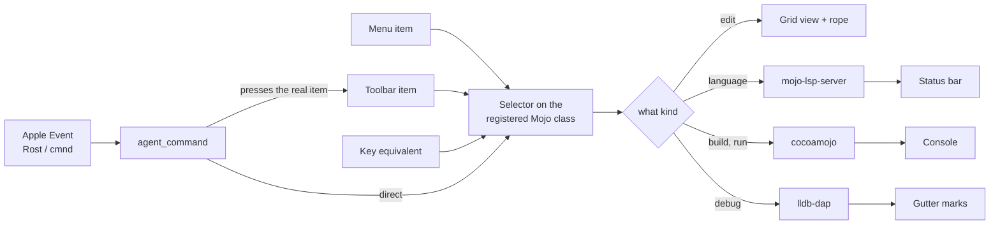

# Roast — the visual design

Roast is a Mojo IDE written in cocoa-mojo. Every view, delegate and action
in it is a Mojo `fn` reached through Objective-C classes registered at run
time: there is no nib, no storyboard, and no Objective-C. What follows is
what the program actually builds, read out of `ide/roast.mojo` and
`ide/gridview.mojo` rather than from intent.

---

## The window

```
┌─────────────────────────────────────────────────────────────────────────────┐
│ ⚒ Build  ▶ Run  ■ Stop     🐞 Debug  ⏩  ⤵  ⤴  ⤶        [ 🔍 Find      ] │ toolbar
├───────────────┬─────────────────────────────────────────────────────────────┤
│               │ ╭───────────╮╭───────────╮╭───╮                             │ tabs 28pt
│  SIDEBAR      │ │ main.mojo ││ life.mojo ││ + │                             │
│  (source      │ ├───────────┴┴───────────┴┴───┴────────────────────────────┐│
│   list)       │ │     1 │ from cocoa.window import Window                  ││
│               │ │     2 │                                                  ││
│  ▸ examples   │ │  ●  3 │ def main():                                      ││ ← breakpoint
│  ▸ stdlib     │ │ ▶   4 │     var w = Window("Hello")                      ││ ← stopped here
│  ▸ ide        │ │     5 │     w.run()                                      ││
│               │ │       │                                                  ││
│               │ │◀─62──▶│                                                  ││
│               │ │gutter │              editor (grid view)                  ││
│               │ ├──────────────────────────────────────────────────────────┤│ ← vsplit
│               │ │ CONSOLE                                                  ││
│               │ │ $ cocoamojo --run main.mojo                              ││
│               │ │ Hello                                                    ││
│               │ └──────────────────────────────────────────────────────────┘│
├───────────────┴─────────────────────────────────────────────────────────────┤
│ ◌  Built main.mojo in 1.2s                                                  │ status 22pt
└─────────────────────────────────────────────────────────────────────────────┘
                ▲
              hsplit
```

Two nested `NSSplitView`s:

| Global | Divider | Separates | Set by |
|---|---|---|---|
| `g_hsplit` | vertical | sidebar ⟷ editor stack | agent `sidebar <pt>` |
| `g_vsplit` | horizontal | editor ⟷ console | agent `console-size <pct>`, **⌘0** |

The status bar is not in the split — it is a plain `NSTextField` pinned to
the bottom of the content view, with the build spinner immediately to its
left, so a compile that is running is visible without stealing layout from
the editor.

### Measurements, as the source states them

| Constant | Value | What it is |
|---|---|---|
| `GUTTER_W` | 62.0 | line-number margin, and the debugger's click target |
| `TAB_H` | 28.0 | the document tab strip |
| `STATUS_H` | 22.0 | the status bar |
| `POPUP_W` | 460.0 | completion popup width |
| `POPUP_ROW_H` | 20.0 | one completion row |

---

## The toolbar

Eleven items, in bar order. The debugger's transport controls sit in the
bar **at all times** rather than appearing when a session starts: a toolbar
that changes shape while you are reaching for it is worse than one whose
items grey out, and `NSToolbar` already knows how to grey an item out.

| # | Identifier | Label | SF Symbol |
|---|---|---|---|
| 1 | `roast.build` | Build | `hammer` |
| 2 | `roast.run` | Run | `play.fill` |
| 3 | `roast.stop` | Stop | `stop.fill` |
| — | `NSToolbarSpaceItem` | | |
| 4 | `roast.debug` | Debug | `ladybug.fill` |
| 5 | `roast.continue` | Continue | `forward.fill` |
| 6 | `roast.stepover` | Step Over | `arrow.right.circle` |
| 7 | `roast.stepin` | Step Into | `arrow.down.circle` |
| 8 | `roast.stepout` | Step Out | `arrow.up.circle` |
| — | `NSToolbarFlexibleSpaceItem` | | |
| 9 | `roast.find` | Find | search field |

`Debug` starts the session; the four after it drive one. Without that first
button the step controls imply a session the bar gives you no way to begin,
and the only answer was a menu shortcut you had to know about.

The find field sits at the trailing edge, where every Mac app puts it.

---

## The menu bar

Nine menus, 52 items. `⌘` unless stated. Selectors are the Objective-C
names the delegate registers at run time.

### Roast

| Item | Key | Selector |
|---|---|---|
| About Roast | | `orderFrontStandardAboutPanel:` |
| Hide Roast | ⌘H | `hide:` |
| Quit Roast | ⌘Q | `terminate:` |

### File

| Item | Key | Selector |
|---|---|---|
| New Tab | ⌘T | `roastNewTab:` |
| Open… | ⌘O | `roastOpen:` |
| Open Folder… | ⇧⌘O | `roastOpenFolder:` |
| Save | ⌘S | `roastSave:` |
| Save All | ⇧⌘S | `roastSaveAll:` |
| Run Script… | | `roastRunScript:` |
| Open Standard Library | | `roastOpenStdlib:` |
| Open IDE Source | | `roastOpenIDESource:` |
| Reset Standard Library & Examples… | | `roastResetUserSpace:` |
| Close Tab | ⌘W | `roastCloseTab:` |

*Open Standard Library* and *Open IDE Source* open the copies in
Application Support, never the installed originals — the editor edits a
copy of itself, and *Reset* puts the copy back.

### Edit

| Item | Key | Selector |
|---|---|---|
| Undo / Redo | ⌘Z / ⇧⌘Z | `undo:` / `redo:` |
| Cut / Copy / Paste | ⌘X / ⌘C / ⌘V | AppKit responder chain |
| Select All | ⌘A | `selectAll:` |
| Complete | **⌃Space** | `roastComplete:` |
| Find… | ⌘F | `roastFind:` |
| Find Next | ⌘G | `roastFindNext:` |
| Find Previous | ⇧⌘G | `roastFindPrevious:` |
| Hide Find | Esc | `roastHideFind:` |

Completion is ⌃Space, not ⌘Space — Spotlight owns ⌘Space, and ⌃Space is
what every other editor uses for *what goes here*.

### Navigate

| Item | Key | Selector |
|---|---|---|
| Go to Definition | ⌘J | `roastGoToDefinition:` |
| Quick Help | ⌘? | `roastHover:` |
| Find All References | ⇧⌘F | `roastFindReferences:` |
| Next Reference | ⌘E | `roastNextReference:` |
| Signature Help | ⌘K | `roastSignature:` |
| Rename… | ⌘R † | `roastRename:` |

All six are language-server round trips. † see *Known defects*.

### Debug

| Item | Key | Selector |
|---|---|---|
| Start Debugging | ⌘Y | `roastDebug:` |
| Stop Debugging | ⇧⌘Y | `roastDebugStop:` |
| Break on Raise | — (checkmark) | `roastBreakOnRaise:` |
| Evaluate Selection | ⇧⌘E | `roastEvaluate:` |
| Continue | *(none)* † | `roastContinue:` |
| Step Over | **F6** | `roastStepOver:` |
| Step Into | **F7** | `roastStepIn:` |
| Step Out | **F8** | `roastStepOut:` |
| Toggle Breakpoint | ⌘\ | `roastToggleBreakpoint:` |
| Clear All Breakpoints | ⇧⌘\ | `roastClearBreakpoints:` |

F6 / F7 / F8 are Xcode's, because the muscle memory of anyone who debugs on
a Mac already has them. *Break on Raise* carries a checkmark reflecting the
`debug.break_on_raise` setting.

### View

| Item | Key | Selector |
|---|---|---|
| Zoom In | ⌘= | `roastZoomIn:` |
| Zoom Out | ⌘- | `roastZoomOut:` |

### Build

| Item | Key | Selector |
|---|---|---|
| Build | ⌘B | `roastBuild:` |
| Run | ⌘R † | `roastRun:` |
| Stop | ⌘. | `roastStop:` |
| Console | ⌘0 | `roastConsole:` |

### Python

| Item | Selector |
|---|---|
| Create or Repair Environment | `roastPythonEnvironment:` |
| Install Project Dependencies | `roastPythonInstallProject:` |
| Install Package… | `roastPythonInstall:` |
| Show Environment Path | `roastPythonShowEnvironment:` |

Every one of these acts on a per-project environment inside Roast's own
Application Support folder. Nothing outside it is ever touched — which is
why the uninstaller's wording says so explicitly.

### Window

| Item | Key | Selector |
|---|---|---|
| Next Tab | ⇧⌘] | `roastNextTab:` |
| Previous Tab | ⇧⌘[ | `roastPrevTab:` |

---

## The editor surface

### The gutter

62 points at the left edge, and the debugger's margin rather than the
text's. A click left of `GUTTER_W` toggles a breakpoint on that line; a
click to the right of it moves the caret. Breakpoints draw as a bar at the
left edge, which reads at a glance without crowding the number.

### The context menu

Right-click in the text builds an `NSMenu` on the spot with Cut, Copy,
Paste and the navigation items. Its entries are **nil-targeted**: they walk
the responder chain exactly as the menu-bar items do, so one implementation
serves both.

### Mouse

| Gesture | Effect |
|---|---|
| click | place caret |
| double-click | select word |
| triple-click | select line |
| click in gutter | toggle breakpoint |
| drag | extend selection |

### Overlays

- **Find bar** — a search field in the toolbar; ⌘G / ⇧⌘G cycle, Esc dismisses.
- **Completion popup** — 460pt wide, 20pt rows, driven by the language
  server and by the Cocoa database, so Objective-C classes, selectors and
  inherited class methods all complete.
- **Status bar** — one line of text plus a spinner that runs while the
  compiler does. The agent surface can read it back verbatim.

---

## The agent surface

Roast answers Apple Events, so it can be driven by AppleScript or by an
agent. Event class `Rost`, event ID `cmnd`, one command in and one line of
reply out. Unknown commands answer rather than failing silently.

| Group | Commands |
|---|---|
| session | `help` · `status` · `console` · `show-console` · `hide-console` · `screenshot [path]` |
| menus | `menus` · `menu <Title>` · `menu <Title> > <Item>` |
| documents | `open <path>` · `save` · `goto <line>[:col]` · `caret` · `file` · `tabs` · `tab <n>` |
| editing | `type <text>` · `find <text>` |
| layout | `views` · `sidebar <pt>` · `console-size <pct>` · `setting <key> [value]` |
| scripting | `run-script <path>` |
| debugger | `debug` · `break <line>` · `continue` · `step-over` · `step-in` · `step-out` · `stopped` · `variables` · `eval <expr>` · `eval?` |

The step verbs go through the **real toolbar items** — looked up in the
live bar, action sent to the item's own target — so an agent run doubles as
a UI test. A button missing from the bar, wired to the wrong selector, or
aimed at a dead target fails there exactly as it would under a pointer.

`screenshot` uses `cacheDisplayInRect:toBitmapImageRep:`, which is view
*drawing* rather than screen capture, so it needs no screen-recording
permission.

---

## How an action reaches the work



Every arrow into the selector is the same door: there is one implementation
per action, and the menu, the toolbar, the keyboard and the agent all knock
on it. That is why driving the toolbar from an agent is a real test of the
toolbar.

---

## Known defects

Two found while writing this document, both in `ide/roast.mojo`:

1. **`⌘R` is claimed twice.** *Navigate ▸ Rename…* and *Build ▸ Run* both
   register a plain `r` key equivalent with no distinguishing modifier
   mask. AppKit resolves a duplicate by menu order, and Navigate precedes
   Build — so ⌘R renames, and there is no working shortcut for Run.

2. **`Debug ▸ Continue` has no usable key equivalent.** It registers the
   string `"\u001b[1;2A"` — an ANSI terminal escape sequence, not a key.
   The three items beside it use `\uf709`, `\uf70a`, `\uf70b` (F6, F7, F8), so
   the intended value is almost certainly `\uf708` (F5).

Neither affects the toolbar buttons or the agent verbs, which reach the
same actions by another door.
