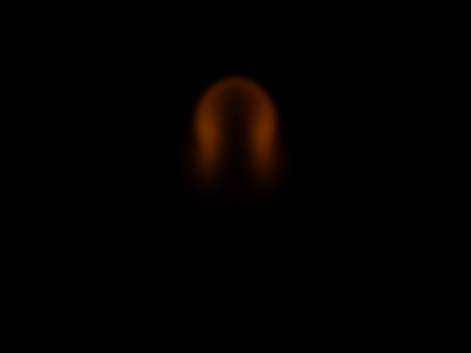

# Cocoa Fluid

A native macOS app written entirely in Mojo — Stable Fluids (Jos Stam,
SIGGRAPH 1999) on the Apple GPU. Drag the mouse and coloured dye swirls
through a velocity field. Every kernel is Mojo, compiled through this fork's
AIR backend; the frame goes to a `CAMetalLayer`. No shader anywhere in the
pipeline.

```
./bazelw build //spikes:fluid_smoke //spikes:fluid
./bazel-bin/spikes/fluid_smoke                    # the solver, headless + checked
./bazel-bin/spikes/fluid                          # the app; launch is queued
APPLEGPU_SYNC_LAUNCH=1 ./bazel-bin/spikes/fluid   # synchronous debug mode
```

`[space]` pause · `[c]` clear · `[r]` rain · `[s]` save a shot · drag to paint ·
close to quit.

`[s]` writes `/tmp/fluid-<n>.png` — a real PNG, deflated through libz, taken
from the same host buffer that is about to be presented so the file and the
window cannot disagree. `FLUID_AUTOSHOT=<frame>` saves that frame and exits,
which is how the picture below was captured on a machine without
screen-recording permission.

## Apple Events — implemented, not yet delivered

`fluid` registers handlers for a `FLUD` event class (`snap`, `clr `, `rain`,
`paus`, `quit`) and `fluidctl <pid> <verb>` sends them. **The sending side
works and the receiving side does not**, and the boundary is worth writing
down because it is not obvious:

- `fluidctl` builds a target descriptor by pid, builds the event, sends it,
  and gets a non-nil reply with no error. The event reaches the process.
- The handler never fires. Adding `-[NSApplication finishLaunching]` and
  servicing `CFRunLoopRunInMode` each frame — the two usual culprits — changed
  nothing.

The cause is structural: this spike uses `mandelbrot`'s hand-rolled
`nextEventMatchingMask:` pump, and Apple Event dispatch is something
`-[NSApplication run]` does, not something the event queue carries. A custom
loop does not get it.

The fix is to move to `life.mojo`'s model — `[NSApp run]` with an `NSTimer`
driving frames — which is a proven-working AppKit integration in this same
tree. The cost is that the `DeviceContext` and its dozen buffers must become
reachable from a C-ABI timer callback, which is exactly why `life` keeps its
state in `named_global`. That refactor is the remaining work; the event class,
the handler, the verb table and `fluidctl` all stay as they are, because they
are registered against the event class and ID rather than against how the loop
is structured.

Addressing by pid also means `osascript` cannot drive it: a `tell application`
clause resolves a name, bundle id, or path to an application *bundle*, and
this is a bare Mach-O binary. Give it a bundle later and
`tell application "Fluid" to «event FLUDsnap»` works with no change to the
receiving side.

## Why this one

The two spikes next door do not measure launch cost: mandelbrot is a single
dispatch per frame and life does none at all. A fluids step is **35 dependent
dispatches** — advect the velocity along itself, take its divergence, run 30
Jacobi iterations on the pressure, subtract its gradient, then carry three dye
channels on the corrected field. Per-dispatch overhead is the dominant term,
which makes this the first spike that can see it.

Measured on an M4 Max, 320×240 grid, 60 steps. The first table is the original
bring-up measurement. A fresh rebuilt-runtime check on 30 August measured
about 0.93 ms/step with default command-buffer batching, 1.06 ms/step with
`APPLEGPU_BATCH_DISPATCHES=0`, and 3.70–3.90 ms/step with
`APPLEGPU_SYNC_LAUNCH=1`. Ten alternating batched/unbatched rounds produced
identical numerical diagnostics and rendered pixel counts; batching removes a
further roughly 12% of step latency.

| launch mode | ms/step | spread across runs |
|---|---:|---|
| synchronous | 10.19 (17.31 cold) | ~70% |
| asynchronous (now default) | **1.99** | ±0.2% |

**5.1×**, and the variance collapses — 0.234 ms of CPU–GPU round trip per
dispatch, in the same ballpark as the 0.40 ms measured independently for short
kernels (`oracles/findings/corpus-measurement-and-issues.md` §7.3).
Synchronously the physics alone consumes an entire 60 fps frame before a single
pixel is drawn.

`APPLEGPU_ASYNC_LAUNCH=0` remains a compatibility opt-out, but new scripts
should use the positive `APPLEGPU_SYNC_LAUNCH=1` debug switch.
`APPLEGPU_BATCH_DISPATCHES=0` keeps queued launch while restoring one command
buffer per dispatch for diagnosis and measurement.

## The physics, briefly

Velocity is advected along itself by tracing each cell backwards through the
field and sampling where it came from. That is unconditionally stable at any
time step, which is the whole reason Stam's method is used rather than a
forward difference. The advected field is not divergence-free, so a Poisson
equation is solved for pressure (Jacobi, ping-ponged between two buffers) and
its gradient subtracted. Dye is passive: it rides the corrected velocity and
does not affect it.

Boundaries are handled by clamping every sample, which lets fluid slide along
a wall rather than leak through it — free-slip, and all this needs.

The Jacobi sweep is ping-ponged rather than updated in place on purpose. A
Jacobi iteration reads the whole neighbourhood of the *previous* iterate;
writing in place would feed half-updated values back in and quietly turn it
into Gauss-Seidel with a thread-order-dependent answer — which on a GPU means
a result that changes with occupancy.

## The pieces

- `fluid_smoke.mojo` — the solver with no window. Steps 60 times and checks
  what a broken kernel would break: dye sum against the dissipation constant
  (mass conservation), post-projection divergence, velocity actually non-zero,
  and a rendered frame that is not entirely black. It writes
  `/tmp/fluid_frame.ppm` so the result can be *looked at* rather than inferred
  from three numbers.
- `fluid.mojo` — the app: window, event pump, mouse forces, hue cycling.

Run the smoke test first if the app ever looks wrong. It separates "the
physics broke" from "the window broke", which from a black window are
indistinguishable.



## Verified

On an M4 Max, 2026-08-25:

```
seeded dye: sum 615.57
60 steps:   dye sum 576.46          (0.999^60 × 615.57 = 580.0 predicted — 0.6%)
            div in [-0.050, 0.046]  (near zero after projection)
            rendered 960×720, 32435 non-black pixels
```

The rendered frame shows the initial circular puff sheared into a crescent and
rolled at one end — a vortex, which is what a shove off the centre of a blob
is supposed to produce.

## Porting note

The Cocoa scaffolding is `life.mojo`'s and the GPU/present path is
`mandelbrot.mojo`'s, both unchanged in shape. This spike uses mandelbrot's
manual event pump rather than life's `NSTimer` + runtime-registered `NSView`
subclass, because the pump keeps the `DeviceContext` and its dozen buffers as
ordinary locals in `main` — the timer route needs every one of them reachable
from a C-ABI callback, which is what drove life to `named_global`.
